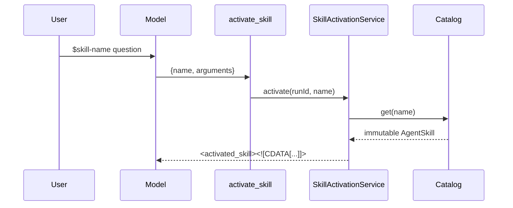

# Skill 激活与去重

## 触发链路

主 agent 的 prompt 要求：相关 Skill 先调用 `activate_skill`；用户输入以 `$<skill-name>` 开头时，必须使用精确名称，并把剩余文本作为 `arguments`。TUI 的 autocomplete 只帮助用户选择名称，真正的激活发生在模型 tool call。



## 去重键为什么包含 contentHash

服务维护 `Map<runId, Set<name:contentHash>>`。同一个 run 内同一名称和同一正文再次激活会失败；Skill 文件 reload 后 hash 变化，可以在新 run 激活新版本。只用 name 会把 reload 后的正文误判成旧内容。

```ts
const key = `${skill.name}:${skill.contentHash}`;
if (runSkills.has(key)) {
  throw new Error(`Skill already activated in this run: ${skill.name}`);
}
```

`release(runId)` 是显式清理入口。当前 `AgentTurnExecutor` 创建 `SkillActivationService` 并把它绑定到 `activate_skill`，但未在 executor 的 turn 完成钩子调用 `release()`；长期进程里需要确认 run 生命周期清理，否则每个 run 的 set 会保留在内存中。

## XML 序列化与 prompt 注入边界

正文包装为：

```xml
<activated_skill name="..." source="..." path="..."><![CDATA[
skill instructions
]]></activated_skill>
```

名称、来源、路径经过 XML escape；正文里的 `]]>` 被替换成 `]]]]><![CDATA[>`，避免关闭 CDATA。tool result 只在模型消息历史中出现，不能修改 system prompt 或全局 catalog。

## 失败语义

- 空名称：立即拒绝。
- 未知名称：返回最多三个相似 Skill。
- 正文为空：拒绝，不返回空 tool result。
- 同 run 重复：拒绝，模型应继续使用已有 `activated_skill`。

Skill 激活是 `readonly` risk，但正文可能包含写文件或命令指令。Skill 本身不获得权限；后续工具调用仍由 Permission policy 判定。把“能读取 Skill”理解成“能执行 Skill 指令”会破坏权限边界。
