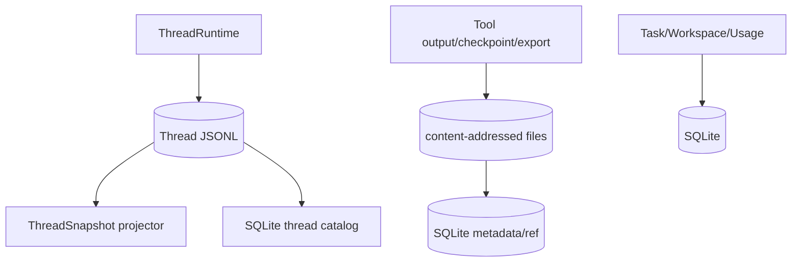

# Storage 存储架构

ello 的存储不是“全部进 SQLite”。Thread JSONL 是会话事实源，SQLite 保存可查询投影和独立产品实体，ArtifactStore 保存大对象。三者按职责拆分。

- [Thread log 与 SQLite 投影](thread-log-and-sqlite-projection.md)：append queue、fsync 边界、schema 校验、恢复和 projection。
- [Artifact 与 Usage 存储](artifact-and-usage-storage.md)：内容寻址、引用 GC、checkpoint 和隐私字段。

默认路径位于 `ELLO_HOME` 或 `~/.ello`：Thread 在 `threads/active|archived/*.jsonl`，数据库在 `state/ello.sqlite`，Artifact 在 `artifacts/<hash-prefix>/<sha256>`。
