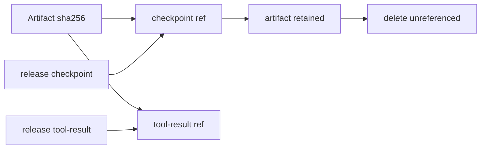

# Artifact 与 Usage 存储

## ArtifactStore 的内容寻址

大工具输出、checkpoint 文件内容和 session export 不直接塞进 SQLite。`ArtifactStore.put()` 对内容计算 SHA-256，artifact id 等于 hash，文件路径由 hash 前两位分片：

```ts
private pathFor(sha256: string): string {
  return path.join(this.rootDir, sha256.slice(0, 2), sha256);
}
```

相同内容复用同一文件和 metadata，只新增 owner reference。已有文件会重新校验 byte size、hash、path 和 content type，hash 相同但 metadata 冲突时拒绝继续。

写新文件时先写唯一临时文件，再 rename 到目标。SQLite 插入失败时，如果本次创建了文件则删除；已有共享文件不会被误删。

## 引用和 GC

`artifact_references` 的主键由 artifact、owner kind、owner id、relation 组成。owner kind 包括 checkpoint、tool-result 和 session-export。释放 owner 后执行 `deleteUnreferenced()`，只删除没有任何引用的 metadata 和文件。



过期清理只删除 tool-result 和 session-export 引用，checkpoint 永久保留。读取 artifact 时再次校验 byte size 和 SHA-256，磁盘损坏不会作为正常内容返回。

## Checkpoint 如何复用 Artifact

`CheckpointRepository.seal()` 对每个 file change 的 before/after 内容创建 artifact，再在 SQLite transaction 中写 checkpoint 和变化元数据。中途失败会释放 checkpoint owner 的全部引用。数据库只保存 path hash、change type、diff、toolCallId 和 artifact ids。

## Usage 为什么不保存 prompt

UsageRepository 只保存模型、provider、状态、token、duration、cache fingerprint、toolCalls 和估算成本。prompt、completion、工具参数、工具结果、Thread 内容都不进入 usage 表。

单次模型调用写入 `usage_model_calls`，run 完成后 `recordRunSummary()` 聚合成 usage_records。`messagePrefixFingerprint`、`systemFingerprint` 和 `toolsetFingerprint` 用于 cache 诊断，不是原文。成本来自 price snapshot，是估算值，不声明为供应商账单。

数据库 migration 在启动前后都校验 journal 前缀、createdAt 和 SQL SHA-256。已执行 migration 被修改，或数据库版本比当前程序新时，Server 拒绝启动，避免旧程序继续写新 schema。
