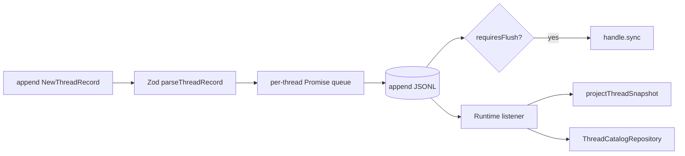

# Thread log 与 SQLite 投影

## JSONL 为什么是 Thread 事实源

一个 Thread 的每次状态变化都是 `ThreadRecord`：thread.created、turn.started、item.delta、transcript.entry、goal.state、plan.state、serverRequest.created、usage.updated 等。每行包含 schema、连续 seq、threadId 和 createdAt。

每个 Thread 有独立 writer queue，不同 Thread 可并行，同一 Thread 的 seq 和落盘顺序严格串行。append 失败不会破坏后续队列：当前 Promise reject，writer.queue 被转换为 settled continuation。

## 哪些记录会 fsync

`turn.completed`、`turn.interrupted`、`turn.failed`、`item.completed`、`serverRequest.created`、`serverRequest.resolved` 会调用 file handle sync。delta 和 transcript entry 不逐条 fsync，降低流式输出的磁盘同步成本；终态和交互边界要求更强的持久性。

创建 Thread 使用 `open(path, 'wx', 0o600)`，防止覆盖已有日志。读取时文件必须以 newline 结束，每行必须是合法 JSON、seq 必须从 1 连续递增、threadId 必须一致，第一条必须是 thread.created。任何不变量失败都返回 `storageCorrupt`，不做静默截断。

## transcript 与领域事件为何共用 writer

`ThreadTranscriptStore` 把 Engine message 写为 `transcript.entry`。它不单独写另一份会话文件，而是调用 `ThreadLogRepository.append()`。Runtime 订阅 writer 的提交结果，只有已经落盘的 record 才更新 snapshot 和 SQLite 投影，避免 UI 看见尚未持久化的状态。

## SQLite 是查询投影

`thread_catalog`、turn/item/request/checkpoint catalog 用于列表、分页和快速恢复定位。JSONL 中的 goal.state、plan.state、transcript.entry 仍由 projector 重放；SQLite catalog 不替代完整 record。

数据库启用 WAL、foreign keys 和 5 秒 busy timeout。Thread log 与 SQLite 没有跨介质事务，顺序策略是 JSONL 先提交，再由 listener 更新投影。SQLite 更新失败时 JSONL 仍保留事实，启动或 repair 可以重建投影；反向顺序会产生无法从事实源解释的数据库行。

## Thread 与执行目录

Thread 是全局一等资源，不绑定 Workspace。`thread.created.cwd` 是创建时确定的执行目录，fork 继承源 Thread 的 `cwd`，resume 始终使用日志中记录的目录。`thread/list` 可以用 `cwd` 筛选；省略时返回全局 Thread。Workspace 生命周期不会修改、隐藏或删除 Thread。

## archive 与 delete

每个 Thread 始终只有 `threads/<threadId>.jsonl` 一份日志。archive 与 unarchive 分别 append `thread.archived`、`thread.unarchived`，不移动或重写文件；`archived` 只表示列表归档状态，最后运行状态保持不变。delete 先 flush writer，再删除明确的文件路径。Thread id 使用白名单正则，并验证 resolve 后仍位于目标目录，避免路径穿越。
