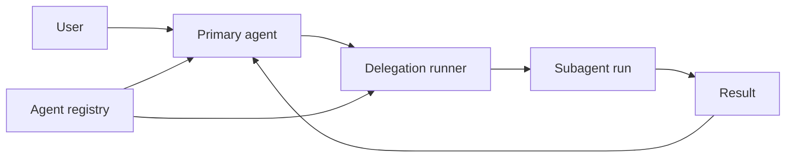

# Subagent 子代理

主 agent 负责当前会话、用户审批和最终答复。代码探索、实现、审查和验证等任务可以拆成有边界的工作单元，由 Subagent 使用独立的提示词、模型 role 和工具集合执行，再把结果交还给主 agent。



## 当前可用状态

当前版本已经提供 Subagent 定义、内置模板、注册表、权限派生和后台任务数据结构。生产 Server 尚未装配 delegation runner，主 agent 还不能创建 Subagent run。

`agent/list` 会返回已发现的 Subagent，并设置以下状态：

```json
{
  "enabled": false,
  "metadata": {
    "mode": "subagent",
    "runtime": "unavailable:no-delegation-runner"
  }
}
```

用户现在可以创建或覆盖 Subagent 定义，用于检查注册和配置结果。定义会进入目录，但当前会话不会执行这些定义。`explore`、`implement`、`review` 和 `verify` 四个随包模板也受同一运行时限制。

## 三种 Agent 形态

| `mode`     | 用途                                  | 当前运行状态                         |
| ---------- | ------------------------------------- | ------------------------------------ |
| `primary`  | 承载用户会话和主回合                  | 可用                                 |
| `subagent` | 接收主 agent 委派的独立任务           | 定义可加载，runner 未装配            |
| `internal` | 执行标题生成、上下文压缩等系统任务    | 系统按功能调用                       |
| `all`      | 同时进入 primary 与 Subagent 选择范围 | primary 可用，委派受 runner 状态限制 |

`role` 负责从当前 profile 中选择模型用途，例如 `primary`、`small` 或 `review`。`mode` 负责确定 Agent 的运行形态，两者分别配置。

## 阅读路径

- [定义与加载](registry-and-loading.md)：创建项目级或用户级 Subagent，选择字段并理解覆盖顺序。
- [权限与工具边界](permission-isolation.md)：了解工具白名单、父级规则继承和默认限制。
- [运行生命周期与当前接线](background-jobs-and-runner-status.md)：了解委派 runner、前后台任务、取消和 internal runner。
