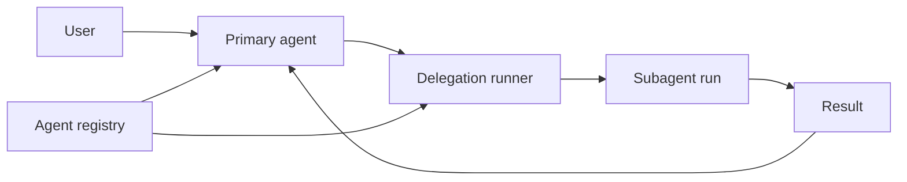

# Subagent 子代理

主 agent 负责当前会话、用户审批和最终答复。代码探索、实现、审查和验证等任务可以拆成有边界的工作单元，由 Subagent 使用独立的提示词、模型 role 和工具集合执行，再把结果交还给主 agent。

```mermaid
flowchart LR
  U[User] --> P[Primary agent]
  R[Agent registry] --> P
  P --> D[Delegation runner]
  R --> D
  D --> S[Subagent run]
  S --> O[Result]
  O --> P
```

## 核心合同

- definition registry 为主 Agent 提供严格的 Subagent 枚举；
- fresh/fork 与 foreground/background 分别描述上下文和调度；
- task、event、usage 和父模型通知通过 Drizzle Store 持久化；
- list/detail/control/transcript 使用独立公开协议和双重连续序号；
- Agent 列表固定在完整 footer 的 cache/token 行之后；
- composer 光标位于最后一个视觉行时按 `↓` 进入列表；
- 主视图最多展示 4 个 child tool call，终态展示有界结果文本；
- root 为 `bypass` 时 child 不产生审批，其他模式与 main 动态一致；
- `x` 停止选中 task 子树，`Ctrl+C` 停止 main 和 root 下全部活动 child；
- 完整工具过程进入 child transcript 查看，不提供展开快捷键。

isolation 合同只接受 shared。请求 `worktree` 或 `container` 必须在启动前明确失败，不能静默
降级到 shared。

## 三种 Agent 形态

| `mode`     | 用途                                  |
| ---------- | ------------------------------------- |
| `primary`  | 承载用户会话和主回合                  |
| `subagent` | 接收主 agent 委派的独立任务           |
| `internal` | 执行标题生成、上下文压缩等系统任务    |
| `all`      | 同时进入 primary 与 Subagent 选择范围 |

`role` 负责从当前 profile 中选择模型用途，例如 `primary`、`small` 或 `review`。`mode` 负责确定 Agent 的运行形态，两者分别配置。

## 阅读路径

- [定义与加载](registry-and-loading.md)：创建项目级或用户级 Subagent，选择字段并理解覆盖顺序。
- [权限与工具边界](permission-isolation.md)：了解工具白名单、父级规则继承和默认限制。
- [运行时架构](runtime-architecture.md)：了解正交运行模式、标识、生命周期、取消、恢复和隔离边界。
- [持久化与公开投影](persistence-and-projection.md)：了解 Drizzle Store、task event 和 TUI 读模型。
- [TUI 导航与运行视图](../tui/subagent-navigation-and-runtime.md)：了解 footer 下 Agent 列表、
  键盘切换、运行摘要、停止和 child transcript 设计。
