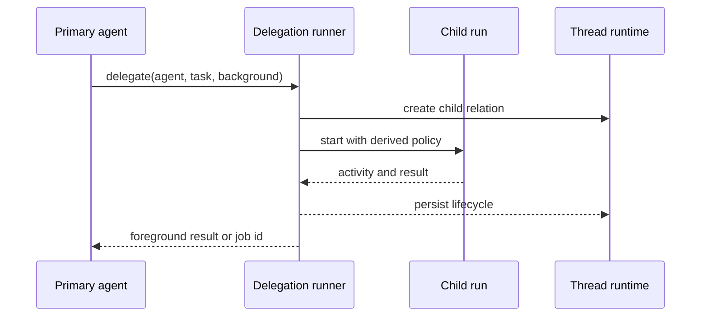
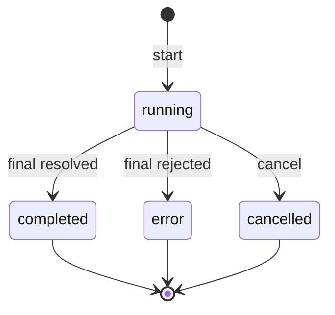

# Subagent 运行生命周期与当前接线

## 为什么委派需要独立 runner？

注册表只描述 Agent 的 prompt、模型 role、工具和权限。一次委派还需要创建 child run、记录父子关系、转发工具活动与审批、处理取消，并把结果写回主会话。这些运行职责由 delegation runner 承担。



## 当前 Server 状态

生产 Server 目前创建注册表并提供 Agent 目录，尚未创建 delegation runner，也没有注册可启动 Subagent 的工具。所有 `mode: subagent` 定义都会得到以下目录属性：

| 字段               | 值                                 |
| ------------------ | ---------------------------------- |
| `enabled`          | `false`                            |
| `metadata.mode`    | `subagent`                         |
| `metadata.runtime` | `unavailable:no-delegation-runner` |

协议和 TUI 已包含 `subagent` Thread item，可展示 `agentName`、前后台标记、状态和输出。展示结构用于兼容已记录事件和后续 runner 接入；当前 Server 不会据此创建 child run。

## 前台与后台委派

delegation runner 需要支持两种结果交付方式：

- 前台委派等待 child 完成，把最终结果直接返回主 agent。
- 后台委派立即返回 job id，由 `BackgroundJobStore` 跟踪状态，并在结束后通知父会话。

`BackgroundJobStore` 是进程内数据结构。每个 job 包含 run id、父会话 id、Agent 名称、标题、时间、状态以及结束后的输出或错误。

```ts
interface BackgroundJob {
  readonly id: string;
  readonly parentSessionId: string;
  readonly agentName: string;
  readonly title: string;
  readonly status: 'running' | 'completed' | 'error' | 'cancelled';
  readonly startedAt: string;
  readonly completedAt?: string;
  readonly output?: string;
  readonly error?: string;
}
```



`start()` 先记录 `running`，再监听运行句柄的 `final` Promise。Promise resolve 写入 `completed` 和输出，reject 写入 `error` 和错误信息。`cancel()` 中断仍在运行的句柄，并把 job 写为 `cancelled`。已结束的 job 保持原终态。

`stopAll(reason)` 会中断当前 Store 中的全部句柄，并等待它们 settle。每个句柄的 `final` Promise 决定对应 job 的结束结果。Store 不写入 Thread JSONL 或 SQLite，Server 进程退出后不会恢复其中的 job。未来 runner 需要把生命周期和结果写入父会话，TUI 才能在重启后恢复历史视图。

## Internal Agent 的运行路径

`runInternalAgent()` 服务于系统内部的单次模型任务。它解析 profile role，只向模型提供 `internal_complete` 工具，应用 `maxTurns`，并在结束后关闭 Agent。当前标题生成和上下文压缩使用这条路径。

Internal Agent 没有用户委派的父子 run 生命周期，也不经过 `BackgroundJobStore`。它的可用状态不能用于判断 Subagent delegation 是否可用。

## Runner 接入范围

生产 delegation runner 需要同时接入以下能力：

- 为 child 分配 run id，并持久化 parent relation 和 `subagent` Thread item。
- 调用 `deriveSubagentPermission()`，装配工具白名单和运行时 policy。
- 把 child tool activity 与审批请求映射到父 connection。
- 统一处理前台结果、后台 job、用户取消和 Server 关闭。
- 将输出、错误和终态写入 Thread 事实源，并覆盖进程重启恢复。

这些能力完成接线与正常、失败、取消、重启测试后，`agent/list` 才能把对应 Subagent 标记为可用。
