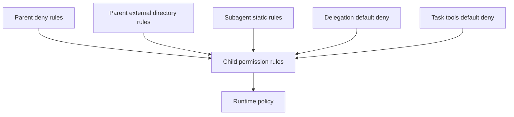

# Subagent 权限与工具边界

## 为什么需要单独派生权限？

Subagent 接收范围明确的任务，同时访问主 agent 所在的工作区。主 agent 已获得的临时授权属于当前 run；Subagent 需要从自己的工具和权限定义重新建立能力边界。父级拒绝规则与外部目录规则继续生效，避免子 run 绕过会话已有的限制。

工具与权限分成两层：

- `tools` 决定模型可以看到和调用哪些工具。
- `permission` 决定一次工具调用得到 `allow`、`ask` 或 `deny`。

`inherit-tools: true` 会省略定义中的工具白名单，由 delegation runner 根据 Agent mode 选择默认工具。当前生产 runner 尚未装配，默认工具集合还没有进入用户 Subagent 的执行路径。

## 权限的组成

`deriveSubagentPermission(parentRules, definition)` 按顺序组合四类规则：

1. 父 agent 的 `deny` 规则和全部 `external_directory` 规则。
2. Subagent 定义中的静态 `permission` 规则。
3. 递归委派的默认拒绝规则。
4. 任务工具的默认拒绝规则。



父 agent 的 `allow` 只授权父 run。Subagent 的调用继续经过自身静态规则、会话模式和 runtime policy。

对应实现为：

```ts
return [
  ...parentRules.filter(
    (rule) =>
      rule.action === 'deny' || rule.permission === 'external_directory',
  ),
  ...(definition.permission ?? []),
  ...(canDelegate ? [] : [denyToolRule('delegate_to_subagent')]),
  ...(canTask ? [] : TASK_TOOL_NAMES.map(denyToolRule)),
];
```

## 默认限制

定义的 `tools` 未列出 `delegate_to_subagent` 时，派生规则会拒绝递归委派。

定义的 `tools` 未列出任何 `task_*` 工具时，派生规则会拒绝七个任务工具：`task_claim`、`task_create`、`task_delete`、`task_get`、`task_list`、`task_reset` 和 `task_update`。列出任意 `task_*` 工具后，派生函数不再添加这组默认拒绝；实际可见工具仍由 `tools` 白名单决定。

`external_directory` 规则约束工作区之外的路径。只读和搜索工具可以把已验证的 Skill 根目录作为 `readRoots` 传给权限系统，这些根目录会从外部路径检查中排除。写工具仍按外部目录规则判定。Subagent 会继承父级规则，Skill 读取例外只适用于已验证的根目录。

## 只读定义示例

只读 Subagent 可以只暴露读取与搜索工具，再通过静态规则固定 Shell 边界：

```yaml
---
description: Inspect code without modifying the workspace.
mode: subagent
role: small
tools: [read, grep, glob]
permission:
  - permission: bash
    pattern: '**'
    action: deny
    scope: default
---
读取委派范围内的代码并返回带路径的分析结果。
```

工具白名单负责缩小模型可见能力，静态 `deny` 负责记录该定义的固定安全约束。完整 delegation runner 还需要把派生结果交给 `AgentTurnExecutor`，并沿用主会话的审批、取消和路径策略。
