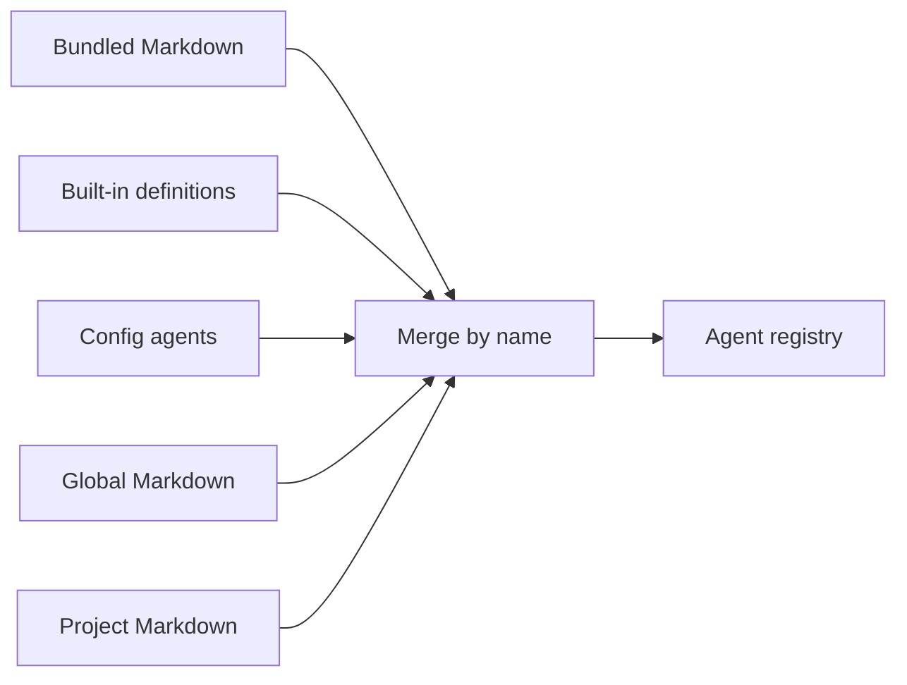

# Subagent 定义与加载

## 为什么需要独立定义？

探索、实现、审查和验证需要不同的提示词与工具范围。Subagent 定义把这些差异放在一个可复用的配置单元中。主 agent 只需要选择定义并传入任务，运行时负责解析模型 role、装配工具和应用权限。

ello 支持 Markdown 文件和 `config.yaml` 两种定义方式。Markdown 适合保存较长的任务说明，`config.yaml` 适合与其他运行配置集中管理。

## 使用 Markdown 定义

项目级定义放在 `<cwd>/.ello/agents/*.md`，只影响当前项目。用户级定义放在 `~/.ello/agents/*.md`，可供所有项目加载。

`.ello/agents/project-review.md`：

```markdown
---
description: Review project changes and report correctness risks.
mode: subagent
role: review
max-turns: 12
tools:
  - read
  - grep
  - glob
---

检查委派范围内的改动。按严重程度列出问题，并提供文件与符号位置。
```

文件名 `project-review` 会成为默认名称。frontmatter 中的 `name` 可以显式指定名称，正文会成为 Agent prompt。

Markdown 必须以 YAML frontmatter 开头，`description` 是必填字段。frontmatter 采用严格校验：未知字段、字段类型错误、YAML 解析失败和未闭合分隔符都会中止注册表初始化。

## 使用配置文件定义

全局或项目 `config.yaml` 可以在 `agent` 映射中声明定义。映射 key 是 Agent 名称。

```yaml
agent:
  project-review:
    mode: subagent
    role: review
    description: Review project changes and report correctness risks.
    max_turns: 12
    tools: [read, grep, glob]
    prompt: |
      检查委派范围内的改动。按严重程度列出问题，并提供文件与符号位置。
```

Markdown 定义默认使用 `mode: subagent`，配置文件定义默认使用 `mode: primary`。通过 `config.yaml` 创建 Subagent 时应显式填写 `mode: subagent`。

## 常用字段

| 目的       | Markdown        | `config.yaml`        | 说明                                                |
| ---------- | --------------- | -------------------- | --------------------------------------------------- |
| 名称       | `name` 或文件名 | `agent` 下的映射 key | 同名定义按来源优先级覆盖                            |
| 描述       | `description`   | `description`        | 用于目录展示和委派选择                              |
| 运行形态   | `mode`          | `mode`               | 可选值为 `primary`、`subagent`、`internal`、`all`   |
| 模型用途   | `role`          | `role`               | 从当前 profile suite 解析模型                       |
| 指令       | Markdown 正文   | `prompt`             | 追加到 Agent 系统提示                               |
| 工具       | `tools`         | `tools`              | Markdown 支持数组或逗号分隔字符串，配置文件使用数组 |
| 工具继承   | `inherit-tools` | —                    | `true` 时由运行时按 mode 选择默认工具               |
| 静态权限   | `permission`    | `permission`         | 与父级派生规则和运行时规则共同判定                  |
| 最大回合数 | `max-turns`     | `max_turns`          | 必须是正整数                                        |
| 固定模型   | —               | `model`              | 覆盖 role 解析出的模型引用                          |
| 隐藏目录项 | —               | `hidden`             | 从用户可选目录中隐藏定义                            |

`inheritTools` 和 `maxTurns` 是 Markdown 兼容字段。新定义使用 `inherit-tools` 和 `max-turns`。`inheritTools` 与 `inherit-tools` 同时出现且值冲突时，加载会失败。

## 内置定义

ello 随包提供四个 `mode: subagent` 定义：

| 名称        | `role`    | 工具范围               | 用途                   |
| ----------- | --------- | ---------------------- | ---------------------- |
| `explore`   | `small`   | `read`、`grep`、`glob` | 只读代码探索           |
| `review`    | `small`   | `read`、`grep`、`glob` | 只读代码审查           |
| `verify`    | `small`   | 只读工具、`bash`       | 执行定向验证           |
| `implement` | `primary` | 读写工具、`bash`       | 完成范围明确的代码修改 |

这些定义当前用于目录和配置覆盖。生产 delegation runner 的状态见[运行生命周期与当前接线](background-jobs-and-runner-status.md)。

## 覆盖顺序

注册表按名称合并定义，右侧来源覆盖左侧同名定义：

```text
bundled Markdown < builtin < config.agent < global Markdown < project Markdown
```



项目 `.ello/agents/explore.md` 可以覆盖随包的 `explore`。用户级 Markdown 会覆盖 `config.yaml` 中的同名条目，项目级 Markdown 再覆盖用户级定义。注册表查询未知名称时会返回错误。

注册表提供三类视图：

- `list({ mode })` 按运行形态列出定义。
- `selectablePrimaries()` 返回未隐藏的 `primary` 和 `all` 定义。
- `delegatable()` 返回未隐藏的 `subagent` 和 `all` 定义。

`agent/list` 基于注册表生成 Server 目录，并额外附加当前 runtime 状态。
