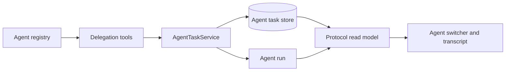
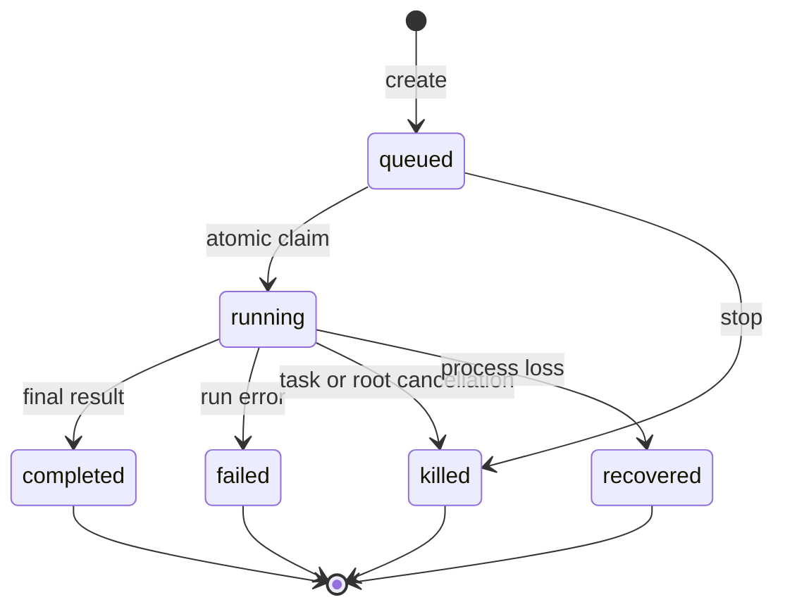
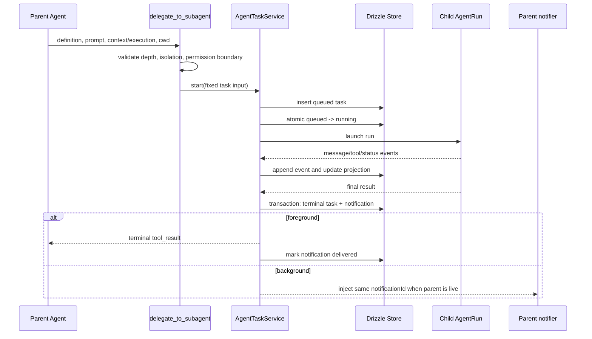

# Subagent 运行时架构

## 1. 架构边界

Subagent 由五个边界组成，任何一层存在都不能代替完整产品闭环：



| 层                | 职责                                               |
| ----------------- | -------------------------------------------------- |
| registry          | 解析 definition、覆盖顺序、模型与工具声明          |
| delegation tools  | `delegate_to_subagent`、`task_output`、`task_stop` |
| task service      | 启动、等待、停止、结果通知和进程内 run 句柄        |
| persistence       | task、sidechain、event、usage、完成通知            |
| public projection | task list、detail、transcript events、恢复序列     |
| TUI               | footer 下 Agent 列表、运行摘要、导航和停止         |

主 Agent 启动 child 后，用户可以在主视图观察有界工具轨迹，在完整 footer 下方选择任务，并
进入任一 child 查看 transcript。停止、resume 和 foreground 转 background 都通过公开协议
执行。运行事实只存在于 Agent Server；TUI 始终通过公开投影读取。

## 2. 标识与关系

以下标识必须有单一含义：

| 字段               | 含义                                 | 稳定范围           |
| ------------------ | ------------------------------------ | ------------------ |
| `taskId`           | 一次可持久查询、停止和恢复的任务记录 | 全局唯一           |
| `agentId`          | 一次实际 Agent run 的原始标识        | 全局唯一           |
| `name`             | 用户或父 Agent 指定的友好名称        | root thread 内唯一 |
| `rootThreadId`     | 创建整棵 Agent 树的主 Thread         | 整棵树不变         |
| `parentTaskId`     | 嵌套委派的直接父 task                | 只描述层级         |
| `resumeFromTaskId` | 新 task 从哪条 sidechain 恢复        | 只描述血缘         |

持久层分别使用 `rootThreadId`、`parentTaskId` 和 `resumeFromTaskId`。resume 创建新 task
时保留原有层级，并把来源 task 写入 `resumeFromTaskId`，恢复血缘不会被误画成嵌套 child。

工具侧允许用 taskId、raw agentId 或 name 查询，但 name 必须先限定 root thread，不能跨
会话命中同名任务。协议和日志统一返回 taskId；agentId 只用于关联底层 run 和遥测。

## 3. 上下文与调度模式

旧 `mode: sync | async | fork` 曾混合两个不同问题：

- child 是新上下文还是父上下文 fork；
- 父工具调用等待还是立即返回。

上下文与调度拆成两个正交字段：

```ts
type ContextMode = 'fresh' | 'fork';
type ExecutionMode = 'foreground' | 'background';
```

工具、协议、Store 与 TUI 只使用这两个字段，不再接受旧枚举。语义上，原 sync 对应
fresh/foreground，原 async 对应 fresh/background，原 fork 对应 fork/background；现在也能
直接表达 fork/foreground。

### 3.1 foreground

`executionMode: foreground` 让当前 `delegate_to_subagent` 工具调用等待 child 终态。最终
task snapshot 作为
`tool_result` 返回，完成通知立即确认，不能再在下一轮重复注入父模型。

foreground task 仍然落盘并进入 TUI 列表，因为用户可能在等待期间查看 child 的工具过程。
进入或退出 child 视图不改变父工具调用的等待关系。

### 3.2 background

`executionMode: background` 创建任务后立即返回 task handle。child 独立运行，完成后写入唯一
持久通知：

```xml
<task-notification>
  <notification-id>...</notification-id>
  <task-id>...</task-id>
  <status>completed|failed|killed</status>
  <summary>...</summary>
  <result>...</result>
</task-notification>
```

父 run 在线时，notifier 可以把同一个 notificationId 加入 live steer；父 run 离线或时机
不合适时，下一轮从数据库注入。两条路径共享 delivered 状态，保证只消费一次。

### 3.3 fork

fork 复制父 run 的 sidechain，并携带父级当时可见的 exact tools，目标是保留稳定上下文
前缀。fork 不能重新按 child definition 随意扩大工具池。

fork 与普通命名 child 使用同一权限合同：每次工具调用通过 `rootThreadId` 读取 root Thread
当前 SessionMode，再叠加 child 工具白名单和 hard boundary。fork 不再使用 `bubble` 一类
字段把权限模式和审批路由混在一起。只有最终决策为 `ask` 时，`AgentTaskService` 才把带
taskId、Agent、description 和 cwd 的 interaction 交给 root connection。

### 3.4 foreground 转 background

foreground child 运行期间，用户可以请求后台化。Service 不创建新 task，而是让原父工具
调用提前返回 task handle，原 child run 继续执行，后续结果转入 notification queue。

该转换需要 Service 持有一个可一次性 resolve 的 delivery gate，并在 Store 中原子更新
executionMode。转换、child 同时完成和父级取消之间存在竞态，必须保证三者最终只有一个
tool result，task 只有一个终态通知。

background 不能转回 runtime foreground，因为父 Agent 已经继续运行；TUI 可以随时把它
设为 UI foreground 查看，这两个概念不能共用一个字段。

## 4. 生命周期

生命周期为：



`completed`、`failed`、`killed` 和 `recovered` 都是原 task 的终态。resume 不回写原状态，
而是创建新 task，并用 `resumeFromTaskId` 指向原记录。这样输出、失败原因和审计轨迹不会被
新一轮覆盖。

Server 初始化时会把遗留 `running` 原子收口为 `recovered`，不会自动重新 launch。用户或父
Agent 必须显式 resume，并得到带 `resumeFromTaskId` 的新 task。

## 5. Service 与 Store

`AgentTaskService` 只持有当前进程才能控制的对象：

- `taskId -> AgentRun`；
- `taskId -> completion Promise`；
- 父 run 的 live notifier。

这些对象在进程重启后消失，不能成为事实源。`AgentTaskStore` 保存：

- 固定运行参数与关系；
- 状态、时间和错误；
- sidechain 与结构化 output；
- usage；
- transcript event；
- 父模型完成通知及交付状态。

Store 的具体 Drizzle 约束见[持久化与公开投影](persistence-and-projection.md)。

## 6. 运行顺序



`AgentTaskService` 的内存 Map 不提供给 RPC handler 或 TUI。查询必须走 Store 生成的公开
projection，停止操作由 Service 先解析持久 task，再尝试命中当前进程 run 句柄。

工具完成事件在持久化前经过有界预处理：序列化结果超过 32 KiB 时，完整内容写入
ArtifactStore，事件只保留 4 KiB preview、artifactId、字节数和内容类型。AgentRun 仍消费原始
事件，因此投影限流不会改变模型上下文。

## 7. 工具合同

### `delegate_to_subagent`

输入包括：

- `subagent_type`、`description`、`prompt`；
- `context_mode: fresh | fork` 与 `execution_mode: foreground | background`；
- 可选 `model`、`cwd`、`name`；
- `isolation: shared | worktree | container`。

isolation 合同只接受 `shared`。`worktree` 与 `container` 必须在启动前明确拒绝，不能接受
参数后仍在 shared 目录运行。

委派工具 schema、协议和持久层只接受两个正交字段，不接受混合语义的旧 `mode`。

resume 是 Service 与 `agent/task/resume` 协议中的显式操作。它会创建新 task，并让权限检查、
血缘和 UI 交互保持可审计。

### `task_output`

返回持久 task snapshot。`block=true` 只等待当前进程已有的 completion；重启恢复后的 task
没有可等待 Promise，应立即返回 `recovered`。输出包含状态、revision、usage、结果或错误，
不能只有终态字符串；完整 transcript 的事件位置由 `agent/task/read` 提供。

### `task_stop`

queued/running task 可停止；终态幂等返回。`agent/task/stop` 的目标是 task 子树，不只是单个
run：Server 先建立 cancellation barrier，再递归收口目标及其全部活动后代、取消 pending
interaction，最后中断内存中的 AgentRun。晚到的 completed 结果不能覆盖 killed。

主 Turn 的中断使用 root 级取消入口。该入口先阻止 root 下继续创建 task，再停止 main run
和全部 queued/running child。TUI 只发送一次 root interrupt，不能按列表逐个调用
`agent/task/stop`。

## 8. 权限与隔离

所有 child：

- 每次工具调用读取 root Thread 当前 SessionMode；
- root 为 bypass 时不产生审批 interaction；
- 继承父级 hard deny 和 external directory 边界；
- 使用 definition 工具白名单和明确 deny 缩小能力；
- 默认禁止递归委派和 task board 工具。

fork Agent：

- 使用父级 exact tools；
- 复制父 sidechain；
- 不创建独立权限模式，仍读取 root Thread mode；
- 最终结果为 ask 时才把请求交给 root connection；
- root connection 不存在时不得静默放行。

权限判断必须先执行 hard boundary，再应用 SessionMode。`bypass` 跳过普通审批，但不覆盖
工具白名单、明确 deny 或 isolation boundary。完整规则见
[Subagent 权限与工具边界](permission-isolation.md)。

### 8.1 取消树

任务取消有两个粒度：

| 入口                | 作用范围                                    |
| ------------------- | ------------------------------------------- |
| `agent/task/stop`   | 目标 task 及全部活动后代                    |
| root Turn interrupt | main run 与 root 下全部 queued/running task |

两种入口都由 Server 建立 barrier，取消 pending approval、用户问题和 foreground delivery
gate，并保证取消期间不能创建漏网 child。completed、failed、recovered 等既有终态保持不变。

shared workspace 只提供权限边界，不提供文件隔离。两个修改型 child 并行写同一文件时仍会
发生竞争；主 Agent 应避免并行派发互相覆盖的写任务。

## 9. 与 Thread 的关系

Agent task 不是普通 Thread，也不能伪造 `threadId = taskId` 后假定所有 Thread 能力都成立。
底层运行请求复用该标识只用于启动 Agent engine；领域模型保持：

- root Thread 负责用户会话、主 Turn、审批连接和最终答复；
- Agent task 负责 child 生命周期、sidechain 和 transcript；
- parent completion notification 注入 root Thread 的模型上下文；
- TUI 通过独立 AgentTaskClient 同时观察两种投影。

`SubagentItem` 可以保留为主 Thread 中的一条委派摘要，但不能承担完整 child transcript
或 Agent 列表。摘要必须带 taskId，并从任务投影读取最近 4 个工具调用、累计 toolCount、终态
指标和有界结果预览；完整内容在进入 child 时读取 task detail。

## 10. 架构范围

本文定义以下闭环合同：

- Drizzle Store、双重连续序号、`recovered` 恢复语义和正交运行模式；
- task list/detail/control/transcript 协议与父模型结果通知；
- footer 下 Agent 列表、主视图有界摘要和 child transcript；
- root Thread 动态 SessionMode、task 子树停止和 root 级联取消。

isolation 只接受 shared。worktree 的创建、合并、冲突和清理策略，以及 container 的镜像、
挂载、网络、权限和 artifact 回收边界，属于独立的 workspace isolation 设计，不在本文展开。

TUI 交互与验收矩阵见
[Subagent 导航与运行视图设计](../tui/subagent-navigation-and-runtime.md)。
