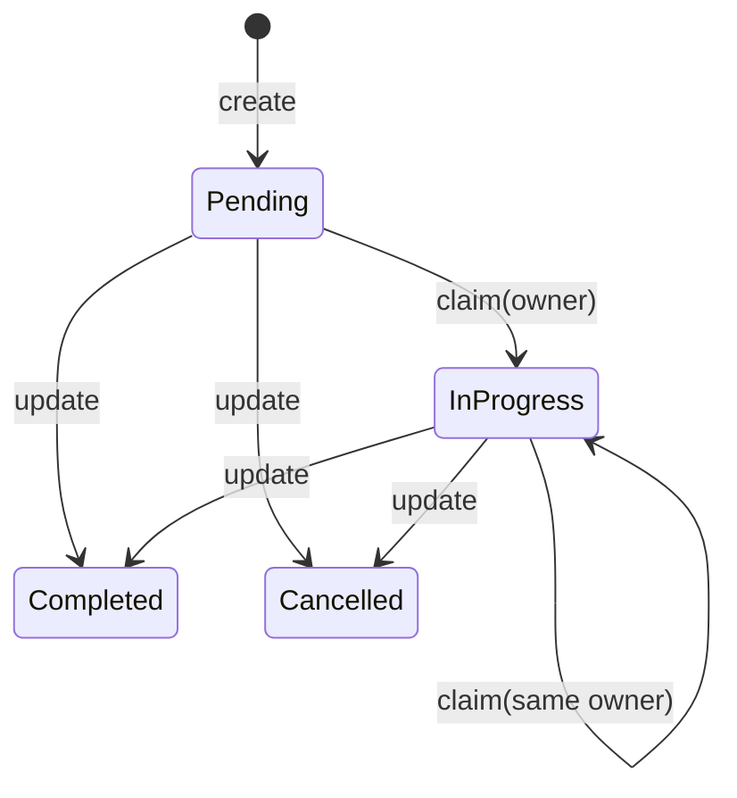
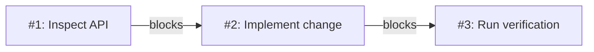
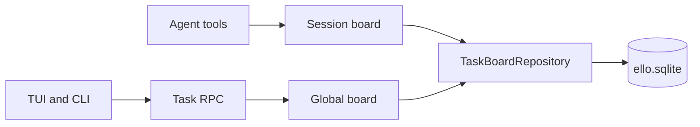

# Task 任务管理

长任务通常包含调查、实现、测试和审查等工作项。对话记录可以保存讨论过程，
Task board 负责保存每个工作项的当前状态、负责人和依赖关系。Agent 可以在后续
turn 中重新查询任务板，按未完成项继续工作。

Task 数据保存在 ello 的 SQLite 状态库中。Agent 工具为当前 Thread 使用独立的
session board；JSON-RPC、TUI 和管理 CLI 默认使用 global board。

## 为什么需要 Task？

单次修改可以直接在一个 turn 中完成。跨文件、跨模块或需要多人协作的工作还要
回答这些问题：

- 哪些工作已经完成？
- 哪个工作项可以开始？
- 哪些工作项正在等待前置任务？
- 当前工作项由谁处理？

**Task board** 把这些信息保存为可查询的结构化数据。每个 Task 包含标题、描述、
状态、owner、依赖和时间戳。短编号用于当前 board 内的交流，UUID 用于稳定引用。

ello 还提供 Goal 和 Plan，三者分别处理不同层级的信息：

| 功能                      | 保存的内容                     | 适用场景                     |
| ------------------------- | ------------------------------ | ---------------------------- |
| [Goal](../goal/README.md) | 一个跨 turn 的目标和累计用量   | 长时间推进同一个结果         |
| [Plan](../plan/README.md) | 修改前可审阅的实施方案         | 先调查和确认范围，再修改代码 |
| Task                      | 多个工作项的状态、owner 和依赖 | 跟踪进度、安排顺序和分配工作 |

一个 Goal 可以对应多个 Task。Plan 描述准备如何修改，Task 记录修改过程中的工作项
和进度。

## 快速开始

在当前 Thread 中明确要求 Agent 使用 Task 工具：

```text
请使用 Task 工具把认证模块重构拆成任务，标出依赖关系，然后从可领取的任务开始执行。
```

Agent 会调用 `task_create` 建立任务，并通过 `blockedBy` 或 `blocks` 保存依赖。后续
turn 可以继续要求 Agent 查询和推进同一块 session board：

```text
请列出当前任务，领取所有前置任务都已结束的下一个任务，完成后更新状态。
```

Agent 可使用七个 Task 工具：

| 工具          | 用途                                       |
| ------------- | ------------------------------------------ |
| `task_create` | 创建任务，初始状态为 `pending`             |
| `task_list`   | 列出当前 board 的全部任务                  |
| `task_get`    | 读取一个任务                               |
| `task_update` | 修改字段、状态和依赖                       |
| `task_claim`  | 设置 owner，并把任务转为 `in_progress`     |
| `task_delete` | 删除一个任务及其依赖边                     |
| `task_reset`  | 清空当前 board，并把下一个短编号恢复为 `1` |

Agent 工具接受 UUID 或 board 内短编号，例如 `2`。删除单个任务后，后续任务继续使用
递增编号；`task_reset` 才会重置编号分配器。

所有 `task_*` Agent 工具都归入 `task` 权限类别。`plan`、
`ask-before-changes` 和 `accept-edits` 模式的默认规则会请求审批，项目规则或会话规则
可以覆盖默认行为；`bypass` 模式自动放行。Agent 定义也可以通过工具白名单隐藏这些
工具。

## Task 字段

| 字段          | 用途                                                 |
| ------------- | ---------------------------------------------------- |
| `subject`     | 工作项标题                                           |
| `description` | 完成条件、约束和相关上下文                           |
| `activeForm`  | 工作进行时供调用方展示的文案                         |
| `status`      | `pending`、`in_progress`、`completed` 或 `cancelled` |
| `owner`       | 当前负责人或 worker 标识                             |
| `blocks`      | 当前任务阻塞的任务                                   |
| `blockedBy`   | 当前任务依赖的前置任务                               |
| `metadata`    | 调用方保存的 JSON 对象                               |

`subject` 应描述可交付的工作项，`description` 应写明完成条件。依赖关系使用 Task 引用，
同一 board 内可以混用短编号和 UUID。

## 状态和领取规则

创建任务固定生成 `pending` 状态。`task_claim` 会在一个 SQLite immediate transaction
中检查状态、依赖和 owner，满足以下条件后写入新的 owner 和 `in_progress` 状态：

- 任务状态为 `pending` 或 `in_progress`。
- `blockedBy` 中的任务都处于 `completed` 或 `cancelled`。
- owner 为空，或已经等于本次 claim 使用的 owner。



`completed` 和 `cancelled` 在 claim 检查中属于终态。`task_update` 可以把状态设置为四种
取值中的任意一种，也可以重新打开已经结束的任务。调用方负责维持符合工作流程的状态
转换。

claim 可能因为未完成的 blocker、其他 owner 占用或终态而失败。Agent 工具会返回
`ok: false`、原因和当前 Task；Agent 可以据此先处理 blocker 或选择其他任务。

## 依赖关系

依赖边的方向为 `blocker -> blocked`。创建任务 `#2` 时设置
`blockedBy: ["1"]`，表示 `#1` 结束后 `#2` 才能被 claim。



`blocks` 和 `blockedBy` 是同一组依赖边的两个方向。Agent 工具在更新时替换指定方向的
完整列表；JSON-RPC 使用 `addBlockedBy` 和 `removeBlockedBy` 增量修改前置任务。

Repository 会拒绝自依赖、未知任务和跨 board 引用。当前 schema 接受多任务构成的
循环依赖；循环中的任务会互相阻塞。创建或更新依赖时应保持有向无环结构。

## TUI 和 CLI

当前客户端有两条默认访问路径：

| 入口                   | 默认 board                    | 能力                               |
| ---------------------- | ----------------------------- | ---------------------------------- |
| 对话中的 `task_*` 工具 | 当前 Thread 的 session board  | 创建、查询、更新、领取、删除和重置 |
| TUI `/tasks`           | global `default` board        | 打开只读任务列表                   |
| `ello tasks`           | global `default` board        | 列出、读取、领取和删除             |
| JSON-RPC `task/*`      | global `default` 或指定 board | 完整的外部 Client 接口             |

TUI 在启动时加载 global `default` board，`/tasks` 面板展示其中最多 12 个任务。它和
Agent 当前 Thread 的 session board 属于两个 scope。当前协议采用查询式任务读取，TUI
通过启动时快照展示任务列表。

管理 CLI 适合查看或处理通过 JSON-RPC 创建的 global Task：

```bash
ello tasks list --json
ello tasks list --board release-2026 --json
ello tasks get <task-uuid> --json
ello tasks claim <task-uuid> --owner reviewer --json
ello tasks delete <task-uuid> --json
```

`list` 的 `--board` 可以使用现有 board UUID，也可以使用 global board 名称。CLI 的
`get`、`claim` 和 `delete` 使用 Task UUID。对话中的 Agent 工具更适合管理当前 Thread
的工作清单。

## 持久化和 scope

Task board 有两种 scope：

- `session`：以 Thread ID 隔离。每个 Thread 使用自己的任务板，fork 后的新 Thread
  使用新的 session board。
- `global`：以名称隔离。JSON-RPC 和管理客户端可以在多个连接之间访问同一块 board。



默认数据库路径为 `~/.ello/state/ello.sqlite`，`ELLO_HOME` 可以修改 ello 的状态目录。
Task 使用 `task_boards`、`tasks` 和 `task_dependencies` 三张表。Thread JSONL 保存对话和
模型运行事件，Task board 保存可变的工作清单。

底层数据模型、事务边界和工具/RPC 契约见
[Task 实现参考](implementation.md)。
