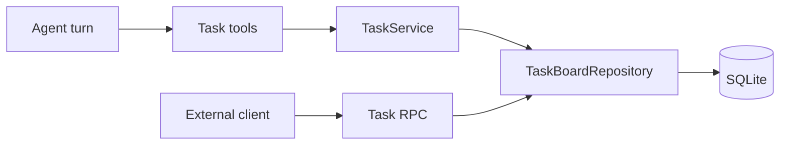
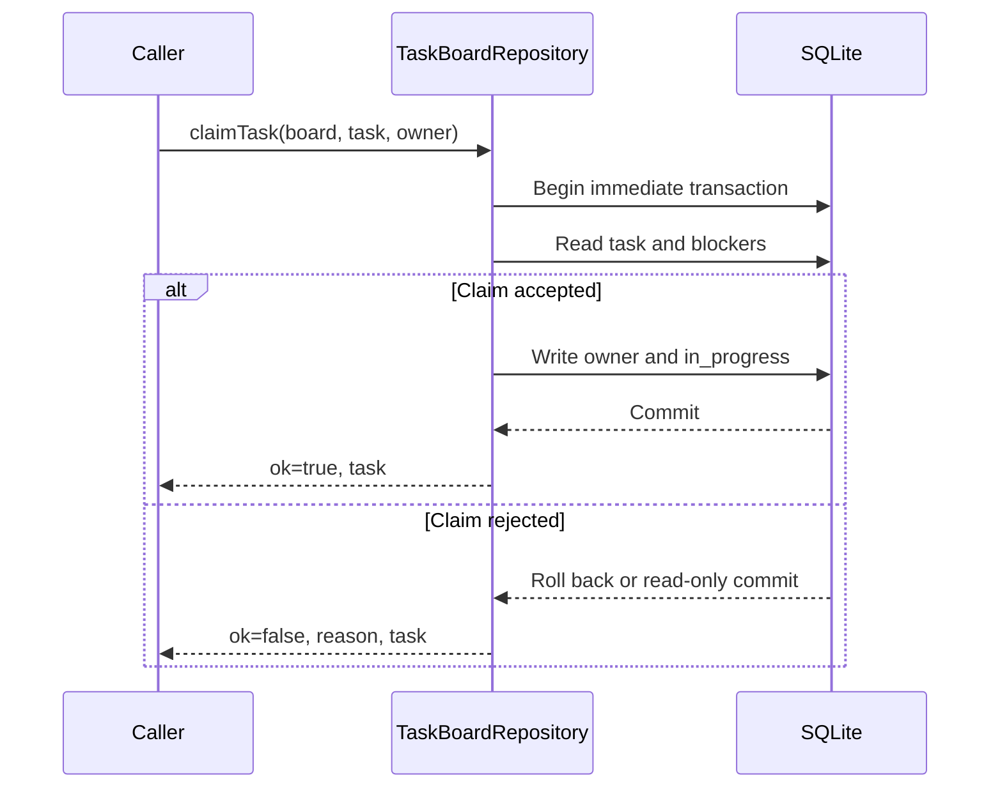

# Task 实现参考

Task 有两类调用方：模型通过 `task_*` 工具管理当前 Thread 的工作清单，外部 Client
通过 `task/*` JSON-RPC 管理指定 board。两类入口共享 `TaskBoardRepository` 和 SQLite
schema，并保留各自的参数与返回契约。

新用户的使用方式、状态含义和客户端命令见 [Task 任务管理](README.md)。

## 为什么使用独立的 Task board？

Thread JSONL 按顺序保存用户消息、模型输出、工具调用和运行状态。Task 的标题、owner、
状态和依赖会被重复修改，读取方通常需要直接获得当前值并按状态筛选。

**Task board** 使用 SQLite 保存当前状态。Thread transcript 与任务清单分别承担事件
历史和工作编排，任务更新无需改写 Thread JSONL。



## Board 和 Task 数据模型

`TaskBoardScope` 支持 session 与 global 两种隔离方式：

```ts
export type TaskBoardScope =
  | { readonly type: 'session'; readonly sessionId: string }
  | { readonly type: 'global'; readonly name: string };
```

`task_boards` 在 `(scope_type, scope_id)` 上有唯一约束。
`getOrCreateBoard()` 使用 immediate transaction 配合 `onConflictDoNothing()`，并发初始化
同一 scope 时会返回同一块 board。

| 表                  | 保存内容                                    |
| ------------------- | ------------------------------------------- |
| `task_boards`       | scope、下一个短编号、创建和归档时间         |
| `tasks`             | Task 字段、UUID、board 内短编号和时间戳     |
| `task_dependencies` | `blocker_task_id -> blocked_task_id` 有向边 |

创建 Task 时，Repository 在同一事务中插入记录、递增 `nextSequence` 并写入依赖边。
唯一键 `(board_id, sequence)` 约束 board 内短编号。单任务删除保留 `nextSequence`，
`resetBoard()` 清空任务后把它恢复为 `1`。

`Task` 在 storage 层包含两个依赖投影：

```ts
interface Task {
  readonly id: string;
  readonly boardId: string;
  readonly sequence: number;
  readonly status: 'pending' | 'in_progress' | 'completed' | 'cancelled';
  readonly blocks: readonly TaskRef[];
  readonly blockedBy: readonly TaskRef[];
}
```

`listTasks()` 读取 board 内的 Task 和依赖边，再由 `projectTasks()` 在内存中组装
`blocks` 与 `blockedBy`。每次列表读取固定执行任务查询和依赖查询，Task 数量不会增加
额外的逐项依赖查询。

## 依赖写入和 claim

`replaceDependencies()` 按输入中出现的方向替换依赖边。`blocks` 更新当前 Task 作为
blocker 的边，`blockedBy` 更新当前 Task 作为 blocked Task 的边。解析引用、删除旧边和
插入新边位于同一个 immediate transaction，任一引用失败会回滚整次更新。

数据库约束与 Repository 检查覆盖以下情况：

- 外键保证依赖引用真实 Task，并在 Task 删除时级联删除边。
- `board_id` 和引用解析保证依赖位于同一块 board。
- check constraint 和 `insertDependency()` 拒绝自依赖。
- 依赖图允许形成环，Repository 当前未执行全图环检测。

`claimTask()` 也使用 immediate transaction。它依次读取 Task、查询未结束 blocker、
检查 owner，再更新状态和 owner。



终态、未完成 blocker 和不同 owner 都会生成 `ok: false`。同一 owner 重复 claim
`in_progress` Task 会成功，并刷新 `updatedAt`。

`updateTask()` 直接接受四种状态，Repository 未维护单独的状态转换表。终态只参与
claim 检查和 blocker 完成判断。

## Agent 工具和 JSON-RPC

两类接口针对不同调用环境提供契约：

| 维度       | Agent `task_*` 工具                    | JSON-RPC `task/*`                   |
| ---------- | -------------------------------------- | ----------------------------------- |
| 默认 scope | 当前 Thread 的 session board           | global `default` board              |
| Task 引用  | UUID 或 board 内短编号                 | UUID                                |
| 进行中状态 | `in_progress`                          | `inProgress`                        |
| 创建依赖   | `blocks`、`blockedBy`                  | `blockedBy`                         |
| 更新依赖   | 按方向替换完整列表                     | `addBlockedBy`、`removeBlockedBy`   |
| claim 拒绝 | `ClaimResult` 的 `ok: false`           | JSON-RPC invalid request error      |
| 访问控制   | Agent permission policy 的 `task` 类别 | RPC capability 的 `read` 或 `write` |

`createTaskTools()` 的 Zod schema 都使用 `.strict()`。模型输入中的额外字段会在执行前
被拒绝。`task_list` 和 `task_get` 标记为 `readonly` discovery risk，其审批回调仍映射到
`task` 权限类别；默认会话规则对该类别使用 `ask`。

Server RPC 使用协议层 `TaskSchema`。协议投影返回 `blockedBy` UUID 数组，省略 storage
层的 `sequence` 和 `blocks`；`protocolTaskStatus()` 在边界处完成 `in_progress` 与
`inProgress` 的转换。

`task/list` 省略 `boardId` 时读取 global `default`。传入值会先按 board UUID 查找；未
找到时以该值作为 global board 名称创建或读取 board。`task/create` 使用相同的 board
解析方式。其他单任务 RPC 根据 Task UUID 定位所属 board。

## 事件和客户端刷新

`TaskService` 可以接收进程内 `TaskEventBus`。通过 Service 完成写操作后会同步发出以下
事件：

- create、update 和成功 claim：`task.changed`、`task.list.changed`
- delete：`task.deleted`、`task.list.changed`
- reset：`task.reset`、空的 `task.list.changed`

事件监听器用于同进程组件，SQLite 保存持久状态。当前 JSON-RPC 协议采用请求响应方式，
任务方法没有对应的 Server notification；RPC 路径直接调用 Repository。TUI 在启动时
调用 `task/list`，`/tasks` 面板使用已加载的 global board 快照。

## 源码位置

| 文件                                                                                                      | 职责                                |
| --------------------------------------------------------------------------------------------------------- | ----------------------------------- |
| [`task.ts`](../../packages/ello-agent/src/agent/tools/task.ts)                                            | 七个 Agent Task 工具及输入 schema   |
| [`types.ts`](../../packages/ello-agent/src/storage/tasks/types.ts)                                        | board、Task、依赖引用和 claim 类型  |
| [`service.ts`](../../packages/ello-agent/src/storage/tasks/service.ts)                                    | board 绑定后的操作和进程内事件      |
| [`task-board-repository.ts`](../../packages/ello-agent/src/storage/repositories/task-board-repository.ts) | SQLite 查询、事务、依赖投影和 claim |
| [`schema.ts`](../../packages/ello-agent/src/storage/database/schema.ts)                                   | 三张 Task 表及数据库约束            |
| [`requests.ts`](../../packages/ello-agent/src/protocol/v1/requests.ts)                                    | JSON-RPC 请求 schema                |
| [`responses.ts`](../../packages/ello-agent/src/protocol/v1/responses.ts)                                  | JSON-RPC Task 投影 schema           |
| [`server-services.ts`](../../packages/ello-agent/src/server/methods/server-services.ts)                   | RPC board 解析和 storage 适配       |
| [`main.ts`](../../packages/ello-tui/src/cli/main.ts)                                                      | `ello tasks` 管理命令               |
| [`OverlayHost.tsx`](../../packages/ello-tui/src/tui/component/OverlayHost.tsx)                            | TUI `/tasks` 面板                   |
