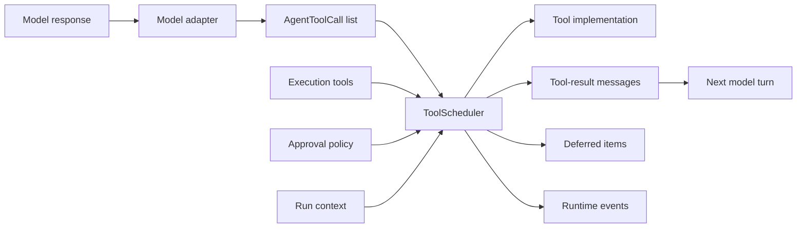
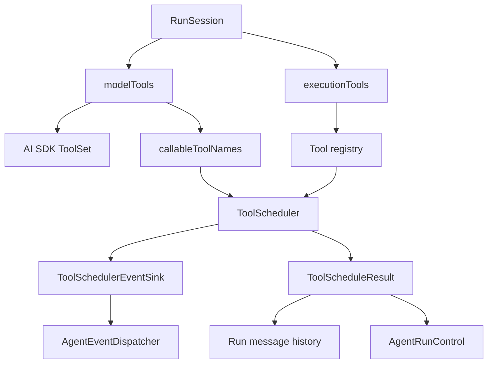
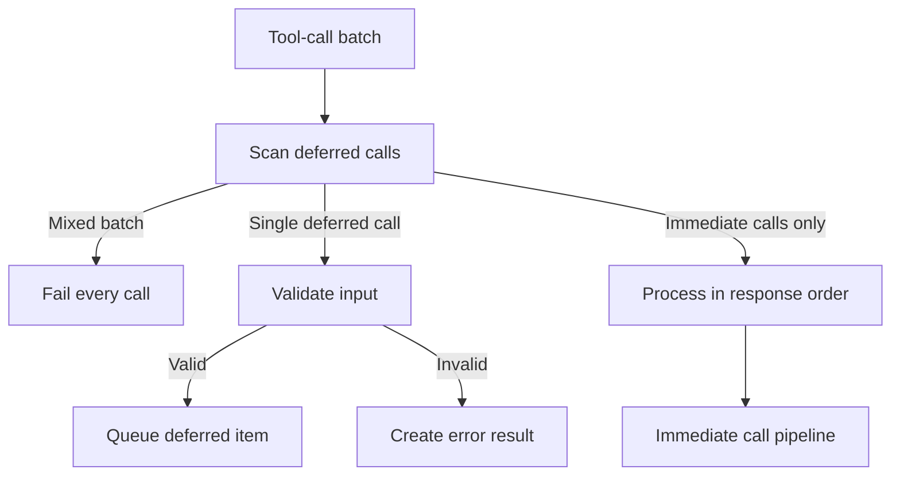
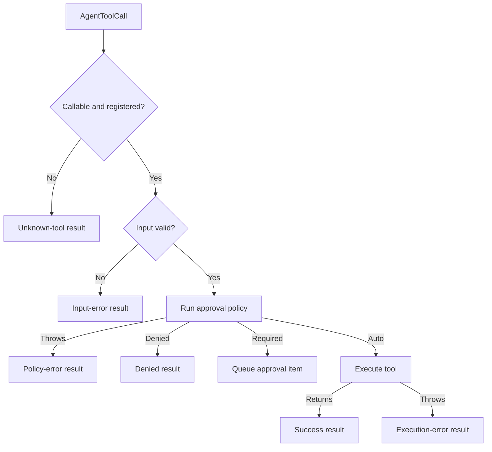

# ToolScheduler：工具执行边界

## 为什么需要这个？

模型只会生成工具名称、调用 ID 和参数。真正执行工具时，还要处理一组与模型供应商无关的约束：

- 工具是否允许由模型直接调用；
- 参数是否满足工具的 Zod schema；
- 权限策略选择自动执行、请求批准还是拒绝；
- 调用如何取得文件系统、Shell、中断信号等运行环境；
- 成功、失败和拒绝如何转换为模型可读取的 `tool-result`；
- 需要用户批准或宿主执行的调用如何暂停并恢复。

**ToolScheduler** 是这些约束的统一执行边界。模型适配器负责把不同供应商的响应归一化为 `AgentToolCall`，调度器负责验证、审批、执行和结果归一化。工具实现不直接交给 provider SDK 执行。



执行权集中在 core 后，所有 provider 使用相同的审批时机、事件顺序和错误格式。新 provider 只需生成标准工具调用，无需复制权限与恢复逻辑。

## 调度器在运行时中的位置

一次 `RunSession` 同时持有两组工具：

| 集合             | 内容                                           | 使用方                                       |
| ---------------- | ---------------------------------------------- | -------------------------------------------- |
| `modelTools`     | 名称、描述和输入 schema                        | `buildToolSet()`，用于构建模型可见的工具定义 |
| `executionTools` | 完整工具定义，包括 `approval()` 和 `execute()` | `ToolScheduler`，用于审批和执行              |

`modelTools` 必须是 `executionTools` 的子集。`RunSession` 还会把 `modelTools` 的名称保存为 `callableToolNames`。调度器同时检查执行注册表和可调用名称集合；存在于执行注册表但未暴露给模型的工具，不能由模型直接点名调用。



各层的职责保持单一：

| 组件                 | 职责                                                              |
| -------------------- | ----------------------------------------------------------------- |
| `buildToolSet()`     | 向模型提供描述和 schema，不携带 `execute()`                       |
| `executeToolCalls()` | 把模型调用交给调度器，并把回调转换为运行事件                      |
| `ToolScheduler`      | 校验可调用性和输入，执行审批策略与工具，归一化结果                |
| `AgentRunControl`    | 保存挂起项，维护 `waiting_approval` 与 `waiting_tool_result` 状态 |
| `prepareResume()`    | 执行已获批准的立即工具，把结果交给恢复消息构造逻辑                |

## 输入与输出契约

### 构造参数

`ToolSchedulerOptions` 把一次运行所需的稳定依赖注入调度器。

| 参数                | 用途                               |
| ------------------- | ---------------------------------- |
| `runId`             | 标识当前 run                       |
| `turnIndex()`       | 在创建工具上下文时读取当前回合序号 |
| `tools`             | 建立工具名到执行定义的索引         |
| `callableToolNames` | 限制模型可直接发起的工具名称       |
| `environment`       | 提供文件系统、Shell 和其他宿主能力 |
| `metadata`          | 向每次调用传递运行元数据           |
| `signal`            | 向工具传递取消信号                 |

调度器为每次立即工具调用创建 `AgentToolContext`：

```ts
{
  runId,
  turnIndex: turnIndex(),
  toolCallId,
  environment,
  metadata: { ...metadata },
  signal,
}
```

`turnIndex()` 在调用发生时求值，批准后的执行会取得恢复 run 的当前回合序号。`metadata` 使用浅拷贝，工具可以读取本次调用的元数据，而不会替换运行级 metadata 对象。工具实现通过 `signal` 响应取消。

### 调度结果

`schedule()` 返回 `ToolScheduleResult`，三个字段分别服务于模型历史、运行观测和挂起控制。

| 字段        | 内容                                                          | 后续用途                       |
| ----------- | ------------------------------------------------------------- | ------------------------------ |
| `messages`  | 已结束调用对应的 `tool-result` 消息                           | 追加到会话历史，供下一回合读取 |
| `toolCalls` | 成功、失败、拒绝和延迟调用的记录；待批准调用由 `pending` 表示 | 汇总到运行结果和观测数据       |
| `pending`   | `DeferredApprovalItem` 或 `DeferredToolCallItem`              | 进入 deferred queue，等待恢复  |

请求批准和延迟执行仍在等待结果，当前回合不会生成 `tool-result`。成功、执行失败、输入失败、未知工具和策略拒绝都已结束，调度器会为它们生成结果消息。

## 两种执行模型

**立即工具**（`execution: 'immediate'`）在 Agent 进程内运行。它可以声明 `approval()`，并通过 `execute()` 使用运行环境。

**延迟工具**（`execution: 'deferred'`）由宿主处理。它只有输入 schema，没有 `execute()` 和 `approval()`。调度器验证输入后生成 `DeferredToolCallItem`，run 以 `waiting-tool-result` 结束，宿主在后续 `resume` 中按调用 ID 回填结果。

| 执行模式                 | 执行位置            | 调度器当前 run 的产物  | 停止原因              |
| ------------------------ | ------------------- | ---------------------- | --------------------- |
| `immediate` + `auto`     | Agent 进程          | `tool-result`          | 继续下一回合          |
| `immediate` + `required` | 批准后由新 run 执行 | `DeferredApprovalItem` | `waiting-approval`    |
| `immediate` + `denied`   | 不执行              | denied `tool-result`   | 继续下一回合          |
| `deferred`               | 宿主                | `DeferredToolCallItem` | `waiting-tool-result` |

### 延迟工具的批次约束

一次模型响应只允许包含一个延迟工具调用。只要可调用的延迟工具与其他调用同时出现，调度器就在任何工具产生副作用前拒绝整批调用，并为每个调用生成 error `tool-result`。

批次级预检保留单一提交边界。立即工具若已执行，延迟工具又等待宿主结果，同一批调用会跨越两个 run；整批拒绝让模型在下一回合重新组织调用顺序。



## `schedule()` 的执行流程

### 批次预检

调度器先扫描可调用的延迟工具，再处理单个调用：

- 混合批次：所有调用依次发出 `started`、`failed` 回调，整批不执行；
- 单个延迟调用：校验输入，成功后进入 `pending` 并发出 `onToolDeferred`；
- 仅含立即调用：按照模型响应中的顺序逐个调度。

顺序执行让文件修改、Shell 命令等副作用保持模型给出的先后关系，事件顺序也与调用顺序一致。某个立即工具失败后，后续调用仍会继续处理。混合延迟批次是批次级失败，不进入逐调用执行阶段。

### 立即工具路径

每个立即调用依次经过可调用性检查、输入校验、审批判定和执行：



输入校验位于审批与执行之前。审批界面读取的是 schema 校验后的输入，工具实现也只接收校验后的值。Zod 默认值和转换会传给 `approval()`；后续分支把同一输入交给 `execute()`、挂起项或已结束调用记录。请求批准的调用由 `pending` 保存，不进入当前 `toolCalls`。

审批函数可以返回字符串，也可以返回带原因和 metadata 的对象：

```ts
type AgentApprovalDecision =
  | 'auto'
  | 'required'
  | 'denied'
  | {
      action: 'auto' | 'required' | 'denied';
      reason?: string;
      metadata?: Record<string, unknown>;
    };
```

未声明 `approval()` 的立即工具按 `auto` 处理。审批函数抛出的异常会转换为本次工具失败；该调用不会进入 `execute()`。

### 结果归一化

调度器捕获非 `Error` 异常并转换为 `Error`，再通过 `normalizeAgentError()` 写入 `AgentToolCall.error`。`createToolResultMessage()` 负责生成 AI SDK v7 兼容消息。

| 状态                      | `tool-result` 输出类型 | 模型收到的内容       |
| ------------------------- | ---------------------- | -------------------- |
| 成功字符串                | `text`                 | 工具返回的文本       |
| `coding-tool-result` 对象 | `text`                 | 对象的 `output` 字段 |
| 其他成功值                | `json`                 | JSON 兼容值          |
| 失败                      | `error-text`           | 归一化后的错误信息   |
| 拒绝                      | `execution-denied`     | 可选的拒绝原因       |

单个失败被收敛为工具结果，回合循环仍可把其他结果一起交给模型。调度器内部一致性错误会直接抛出，例如延迟工具绕过批次预检，交由 run 的兜底错误处理结束运行。

## 事件与状态投影

`ToolSchedulerEventSink` 隔离调度决策与运行事件系统。调度器只调用语义回调，`executeToolCalls()` 再把它们转换为 `EngineEvent`，并维护 deferred queue。

| 调用结果             | 调度器回调                             | 运行时处理                                |
| -------------------- | -------------------------------------- | ----------------------------------------- |
| 成功                 | `onToolStarted` → `onToolCompleted`    | 发出 `tool.started`、`tool.completed`     |
| 输入、策略或执行失败 | `onToolStarted` → `onToolFailed`       | 发出 `tool.started`、`tool.failed`        |
| 策略拒绝             | `onToolStarted` → `onToolFailed`       | 发出失败事件，消息状态为 denied           |
| 请求批准             | `onToolStarted` → `onApprovalRequired` | 发出审批事件，加入 deferred queue         |
| 延迟执行             | `onToolDeferred`                       | 发出 `tool.deferred`，加入 deferred queue |

`tool.started` 表示调用进入可观测的处理路径。输入校验或审批策略已经可能在该事件前完成，工具的 `execute()` 只在 `auto` 分支中运行。延迟工具由 `tool.deferred` 表达挂起状态。

`executeToolCalls()` 会按 `toolCallId` 检查 deferred queue。相同挂起项只入队一次，避免重复发布 `approval.required` 或 `tool.deferred`。

## 审批与延迟结果如何恢复

挂起会结束当前 run。恢复由新的 run 接收 deferred 项、审批决定或宿主结果，再补齐模型要求的 tool-call/tool-result 消息对。

```mermaid
sequenceDiagram
  participant Model
  participant Loop as Agent loop
  participant Scheduler as ToolScheduler
  participant Control as Run control
  participant Host

  Model->>Loop: tool call
  Loop->>Scheduler: schedule(calls)
  alt Approval required
    Scheduler-->>Control: DeferredApprovalItem
    Control-->>Host: waiting-approval
    Host->>Loop: resume(approvals)
    Loop->>Scheduler: executeApproved(call)
    Scheduler-->>Loop: output or error
  else Deferred execution
    Scheduler-->>Control: DeferredToolCallItem
    Control-->>Host: waiting-tool-result
    Host->>Loop: resume(toolResults)
  end
  Loop->>Control: create recovery messages
  Control-->>Model: tool-result in next turn
```

### 批准后的立即工具

`prepareResume()` 遍历 `DeferredApprovalItem`。批准项尚无结果时，它调用 `executeApproved()`；拒绝项发出失败事件，并在恢复消息中生成 `execution-denied` 结果。

`executeApproved()` 跳过审批策略，因为恢复参数已经携带用户决定。它仍会执行以下检查：

- 工具存在于执行注册表和 `callableToolNames`；
- 工具类型为 `immediate`；
- 输入重新通过 Zod schema 校验；
- 执行使用新 run 创建的 `AgentToolContext`；
- 成功与失败继续发出对应事件。

重新校验输入可以覆盖持久化、传输和恢复之间的数据边界。`executeApproved()` 返回带输出或错误的 `AgentToolCall`，`prepareResume()` 把结果写入 `toolResults`。

### 宿主执行的延迟工具

宿主使用 `DeferredToolCallItem.toolCallId` 关联结果，并通过 `resume.toolResults` 回填。恢复逻辑会检查两类错误：结果引用了未知调用 ID，或延迟工具缺少结果。校验通过后，`AgentRunControl` 创建 `tool-result`。

会话历史中可能已经持久化 assistant 的 tool-call。`createRecoveryMessages()` 先收集已有调用 ID：已有调用只补结果；缺少调用时补齐 assistant tool-call 和 tool-result。该规则保持调用 ID 唯一，并满足 provider 对消息配对的要求。

## 调度不变量

阅读或修改调度器时，可以用以下约束检查行为：

1. 模型只能直接调用 `callableToolNames` 与执行注册表的交集。
2. 输入先于审批和执行完成校验，批准后执行时再次校验。
3. `required` 和 `deferred` 分支在当前 run 中不产生工具副作用。
4. 已结束的调用产生 `tool-result`；挂起调用在恢复时补结果。
5. 立即调用按模型响应顺序执行，单个调用失败不会停止后续调用。
6. 混合延迟批次在副作用发生前整批失败。
7. 所有工具执行都取得 `runId`、回合、环境、metadata 和取消信号。

## 源码阅读入口

| 文件                                                                                      | 内容                                       |
| ----------------------------------------------------------------------------------------- | ------------------------------------------ |
| [`tool-scheduler.ts`](../../packages/ello-agent/src/agent/engine/core/tool-scheduler.ts)  | 调度主流程、审批分支、立即执行与批次预检   |
| [`tool-execution.ts`](../../packages/ello-agent/src/agent/engine/core/tool-execution.ts)  | 事件回调适配与 deferred queue 入队         |
| [`run-session.ts`](../../packages/ello-agent/src/agent/engine/core/run-session.ts)        | 调度器装配、回合结算与停止条件             |
| [`resume.ts`](../../packages/ello-agent/src/agent/engine/core/resume.ts)                  | 批准后的工具执行与结果回填                 |
| [`run-control.ts`](../../packages/ello-agent/src/agent/engine/core/run-control.ts)        | 挂起状态和恢复消息配对                     |
| [`tool-messages.ts`](../../packages/ello-agent/src/agent/engine/core/tool-messages.ts)    | tool-call/tool-result 消息编码             |
| [`tool-scheduler.test.ts`](../../packages/ello-agent/tests/engine/tool-scheduler.test.ts) | 输入复验、审批异常、延迟工具和混合批次测试 |

相关架构说明：

- [Agent 与回合循环](../agent/agent-loop.md)
- [模型输入、工具与恢复](../agent/model-input-tool-loop-and-resume.md)
- [Permission 权限系统](../permission/README.md)
