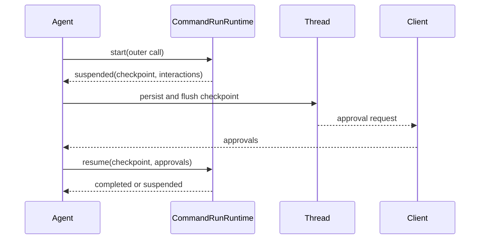

# Command Run：统一执行模块

> 本页保留原文档路径以维持站内链接；旧 provider Tool 批次调度器已经删除。

模型只生成一个 outer `command_run` call。`CommandRunRuntime` 隐藏 Frame codec、Command
Catalog、Command compiler、Environment Gate、审批、deferred 和恢复逻辑，Agent engine 只依赖：

```ts
interface CommandRunRuntime {
  readonly modelTool: CommandRunModelTool;
  readonly catalogRevision: string;
  start(request: StartCommandRun): CommandRunExecution;
  resume(request: ResumeCommandRun): CommandRunExecution;
}
```

该 interface 是调用方和测试共同使用的 seam。内部实现位于 `features/command/catalog.ts` 与
`runtime.ts`，不会把 registry、scheduler 或 provider 细节扩散到 Agent。

## 编译边界

`start()` 在执行任何 Command 前严格校验整个请求：

- 1 至 32 个 Frame，序列化输入不超过 1 MiB；
- `step` 是正整数并按输入顺序非递减；
- 未知字段失败，不接受别名、JSON fence 或顺序修复；
- `input` 与 `args/body` 互斥，且 v1 只给 `command_invoke`；
- Command 必须存在于当前 Catalog，参数按准确 codec 和领域 schema 解析；
- 每条 Frame 获得稳定 `commandId` 和类型化 input digest。

任一 Frame 失败都会拒绝全批，错误包含 frame index、command 与 usage。已经通过编译的前缀
也不会运行，因此无“部分校验、部分副作用”的状态。

## Scheduling Phase

相同 `step` 属于同一 Scheduling Phase；前一 phase 结束后才开始后一 phase。运行时根据
Command 的动态 capability 与 Environment Gate 决定真正执行方式：

```text
safe shared reads -> concurrent
write/shell/external/unknown effect -> exclusive
next step -> strict barrier
```

模型表达依赖阶段，不声明底层锁。只有明确 `readOnly && concurrencySafe && !destructive` 的
Command 才可并发；其余情况保守串行。Environment generation 共享同一 Gate，因此不同
Handle 上的冲突修改也不会交错。结果按 Frame 顺序保存，事件按实际发生时间发布。

## 失败语义

Command Run 默认使用 step 级失败屏障且不自动回滚：

- 同一 step 的 immediate Command 相互独立，一个失败或拒绝不阻止同 step 的后续 wave；
- step 完成后，`failed` 或 `denied` 会阻止后续 step 的普通 Command；
- 未执行 Frame 记录 `blocked` 与 `blockedBy`；
- 显式 `onFailure: 'continue'` 的 Frame 失败后继续执行后续 Frame，但整批结果仍为失败；
- 只有显式 `onFailure: 'diagnose'` 且运行时证明安全只读的 Command 可以继续；
- `denied` 和 `interrupted` 不受 `onFailure: 'continue'` 影响；
- Shell 非零退出是失败，除非 Shell 程序自己显式吸收该退出码；
- 中断停止新工作，并取消声明为 interruptible 的在途工作。

文件、进程和远端系统没有统一事务，因此 runtime 不伪装原子回滚。

## Command Catalog 与 Registry

核心 Catalog 提供 `read`、`search`、`write`、`apply_patch` 和 `bash`。`search` definition
直接拥有 content/file 两种搜索；文件 version/digest、diff、artifact、进程管理等领域语义仍由
对应 Command 实现。

discoverable Ello/MCP 能力由 `command_search` 和 `command_invoke` 使用。Registry 直接复用目标的
schema、Effect、validation、approval 与 immediate/deferred 定义，不合成内部 provider Tool Call，
也不能递归调用三个内部入口。核心写入与 Shell 不是 `command_invoke` target，Plan mode 和权限判定
因此只有一条执行路径。

## Phase 审批

runtime 会在 phase 开始前准备全部 Command。每条审批绑定 command identity、input digest、
catalog revision 和权限 metadata；只要有一条需要审批，整个 phase 暂不执行。


```mermaid
sequenceDiagram
  participant Agent
  participant Runtime as CommandRunRuntime
  participant Thread
  participant Client
  Agent->>Runtime: start(outer call)
  Runtime-->>Agent: suspended(checkpoint, interactions)
  Agent->>Thread: persist and flush checkpoint
  Thread-->>Client: approval request
  Client-->>Agent: approvals
  Agent->>Runtime: resume(checkpoint, approvals)
  Runtime-->>Agent: completed or suspended
```

拒绝的 Command 记录为 `denied`；同 step 的独立兄弟继续执行，该 step 完成后再阻断后续 step。
批准不会永久放宽权限；恢复执行前仍重新运行动态 capability、validation 和环境级约束。

## Deferred 与恢复

Deferred capability 没有 Agent 进程内 `execute()`。运行到它时，runtime 保留完成前缀、阻断
尾部、生成 checkpoint，并把 interaction 交给宿主。外部结果通过 `resume(toolResults)` 关联到
原 `commandId`。

Checkpoint 包含 compiled frames、已有结果、phase cursor、审批记录、pending command IDs、
outer provider call ID、input digest 与 catalog revision。恢复不重新解析模型文本，不重放已完成
Command；catalog revision 不一致直接失败。崩溃时持久记录中的 running Command 标记为
`interrupted`，有副作用的操作不会自动重试。

## 事件与持久化

Runtime 发布 `command_run.started/failed/completed/suspended` 与
`command.started/completed/failed/blocked/approval_required/deferred`。Agent 将其包装成
`command.event`，Thread JSONL 持久化一个 `commandRun` item，TUI live 与 reload 都从相同事实
记录渲染 logical name、Shell 输出、diff、审批和最终状态。

Provider transcript 只保留 outer `command_run` call/result；内部事件不进入模型工具历史。

## 源码与测试入口

- `packages/ello-agent/src/features/command/index.ts`
- `packages/ello-agent/src/features/command/catalog.ts`
- `packages/ello-agent/src/features/command/runtime.ts`
- `packages/ello-agent/src/features/agent/engine/tools.ts`
- `packages/ello-agent/src/features/thread/run-records.ts`
- `packages/ello-agent/tests/command/command-run-runtime.test.ts`
