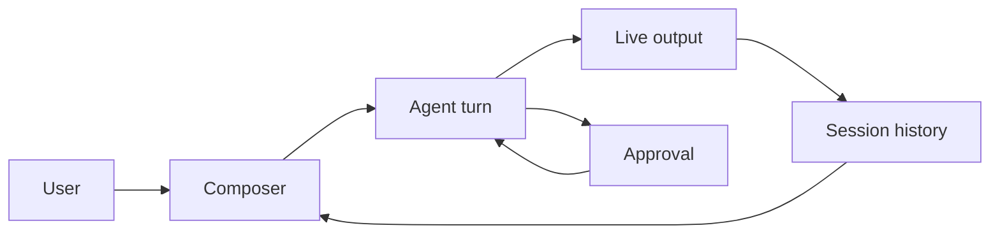
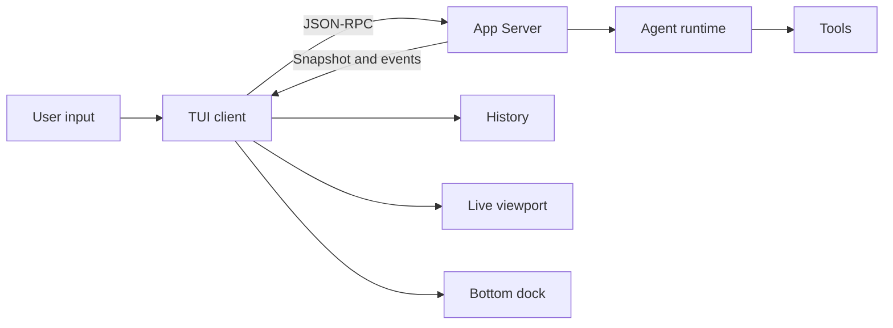

# TUI 使用指南

ello TUI 在终端中提供持续的 Coding Agent 会话。用户可以提交任务、观察模型和工具的
实时输出、处理审批，再用后续消息调整执行方向。每个会话绑定一个工作目录，历史记录、
当前模式和 token 用量随会话保存。

## 为什么使用 TUI？

代码任务通常包含仓库调查、文件修改、命令执行和多轮确认。普通命令行输出适合执行一次
提示词；TUI 把运行状态、审批和后续输入放在同一个终端界面，适合需要持续交互的任务。



## 启动前准备

环境要求为 Node.js 22+ 和 pnpm 10+。在源码仓库中安装依赖并构建：

```bash
pnpm install
pnpm build
pnpm --filter @ello/tui run ello
```

已经全局安装 `ello` 时，在需要处理的项目目录中直接启动：

```bash
cd /path/to/project
ello
```

TUI 使用当前目录作为会话工作目录。也可以通过 `--root` 指定目录：

```bash
ello --root /path/to/project
```

ello 会启动本地 App Server 并创建一个 Thread。Provider、Model 和 Profile 的配置方式见
[配置系统](../config/README.md)。源码仓库的完整安装命令见
[项目快速开始](../../README-zh.md#快速开始)。

TUI 需要交互式终端。标准输入或标准输出连接到管道时，`ello` 显示 CLI 帮助；自动化场景
可以使用 `ello --no-tui run "<prompt>"`。

## 认识主界面


界面按信息生命周期分为三个区域：

| 区域       | 内容                                                         |
| ---------- | ------------------------------------------------------------ |
| 会话历史   | 会话信息、已提交的消息、已完成的工具调用和运行结果           |
| 实时输出   | 模型流式文本、运行中的工具、Subagent 和排队中的追加指令      |
| 底部操作区 | 临时面板、输入框、Profile、会话模式、Goal、缓存和 token 用量 |

会话开始时，历史顶部显示当前 Profile、工作目录、Model 和会话模式。底部状态栏会随配置、
模式和用量更新。终端自身的滚动能力用于查看较早的会话历史。

## 完成一次任务

在底部输入框中输入目标并按 `Enter`：

```text
检查当前仓库的测试失败，修复根因并运行相关测试。
```

ello 会把输入加入历史，并在实时区域显示模型回复和工具调用。默认
`ask-before-changes` 模式允许读取与搜索；修改文件、运行 Shell 命令等操作会打开审批面板。
使用方向键选择处理方式，按 `Enter` 确认。

运行期间可以直接提交补充要求。新消息会进入当前 Turn 的指令队列：

```text
先只运行这个模块的测试，不要执行全量测试。
```

任务完成后继续输入下一条消息即可保留当前上下文。`Ctrl+C` 中断正在运行的 Turn；空闲且
输入框为空时再次按 `Ctrl+C` 退出。`/quit` 也可以退出 TUI。

## 接下来阅读

- [输入、快捷键与命令](input-and-commands.md)：多行输入、文件引用、Skill、Shell、
  Slash Command 和审批面板。
- [会话、模式与上下文](sessions-modes-and-context.md)：恢复会话、切换权限模式、分支、回退、
  压缩和连接恢复。
- [权限与审批](../permission/README.md)：各模式的权限范围和持久规则。
- [Plan 模式](../plan/README.md)：调查、计划审阅和进入执行阶段。

## TUI 如何接收结果

TUI 是 App Server 的 Client。用户输入通过 JSON-RPC 发送到 Server，Server 持有 Agent、
权限规则和 Thread 历史。TUI 根据 Thread snapshot 和后续通知更新界面。



切换或恢复会话时，TUI 使用完整 snapshot 重建历史和实时状态。界面缓存可以重新生成，
Thread 记录仍由 Server 保存。组件和状态投影的详细设计见
[Coding Agent TUI 设计稿](ello-tui-design.md)。
