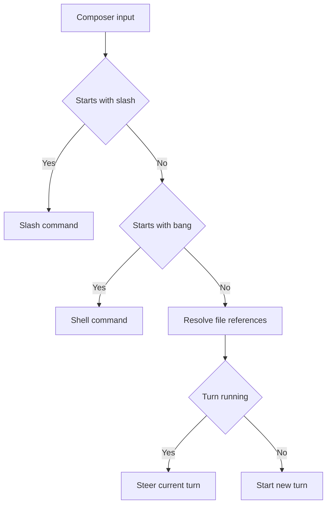

# 输入、快捷键与命令

Coding Agent 的输入同时包含任务描述、文件上下文、Skill、Shell 命令和会话操作。TUI 通过
输入前缀区分这些用途，并在输入框中提供候选项。普通文本发送给 Agent，带前缀的输入走
对应的文件、Skill、Shell 或 Slash Command 路径。

## 提交任务和补充要求

普通文本会启动一个 Turn：

```text
阅读认证模块，说明登录状态的保存位置。
```

Turn 运行期间提交的普通文本会追加到当前运行。实时区域会显示
`Messages queued for the running turn`，Agent 在当前执行过程中接收这些补充要求。

```text
同时检查刷新令牌过期后的处理。
```

`Ctrl+C` 可以中断运行。Agent 尚未产生完整运行轨迹时，TUI 会把刚提交的内容放回输入框，
便于修改后重试。

## 编辑多行内容

输入框保存多行文本和光标位置。`Shift+Enter` 插入换行；终端无法区分
`Shift+Enter` 时，可以在行尾输入 `\` 后按 `Enter`。TUI 会移除行尾的 `\` 并插入换行。

| 按键          | 输入框行为                                       |
| ------------- | ------------------------------------------------ |
| `Enter`       | 提交当前内容                                     |
| `Shift+Enter` | 插入换行                                         |
| `Tab`         | 接受当前补全候选                                 |
| `↑` / `↓`     | 移动多行光标、切换候选，或在空输入时浏览历史输入 |
| `←` / `→`     | 移动光标                                         |
| `Ctrl+A`      | 移到当前行行首                                   |
| `Ctrl+E`      | 移到当前行行尾                                   |
| `Ctrl+K`      | 删除光标到当前行行尾的内容                       |
| `Ctrl+U`      | 删除当前行行首到光标的内容                       |
| `Ctrl+W`      | 删除光标前一个词                                 |
| `Ctrl+C`      | 运行时中断；空闲时先清空草稿，输入框为空时退出   |
| `Esc`         | 关闭普通面板；没有面板且 Turn 运行时中断         |
| `Shift+Tab`   | 循环切换可用的会话模式                           |

方向键会优先处理当前多行光标。单行输入存在补全候选时，`↑` 和 `↓` 切换候选；空输入时，
它们读取当前会话中已经提交过的输入。

## 引用文件

输入 `@` 和部分路径会触发工作目录内的文件搜索。使用方向键选择候选，再按 `Tab` 接受：

```text
解释 @packages/ello-tui/src/tui/App.tsx 的输入路由。
```

提交时，匹配到的 `@path` 会转换为文件引用并随文本一起发送。没有匹配结果的 token 会保留
为普通文本。相同文件在一条输入中只附加一次。

## 使用 Skill

输入 `$` 和 Skill 名称会显示当前会话可用的 Skill。候选项包含名称、来源和说明；按 `Tab`
接受后，TUI 会在 Skill 名称后补一个空格。

```text
$zh-technical-writing 重写这份设计说明。
```

Skill 目录和覆盖规则见 [Skills 技能目录](../skills/README.md)。

## 执行 Shell 命令

行首使用 `!` 可以在当前 Thread 的工作目录中执行 Shell 命令：

```text
!git status --short
```

命令完成后，标准输出、标准错误和退出码会写入会话历史。Shell 仍受当前会话模式和权限规则
约束；`ask-before-changes` 通常会显示审批，`plan` 会拒绝 Shell 操作。

## 使用 Slash Command

行首输入 `/` 会显示命令候选。输入部分名称后使用方向键选择，按 `Tab` 补全，按 `Enter`
执行。`/help` 在 TUI 内显示常用命令。

| 命令                              | 用途                                       |
| --------------------------------- | ------------------------------------------ |
| `/help` 或 `/?`                   | 显示帮助                                   |
| `/mode <mode>`                    | 设置当前会话模式                           |
| `/plan`                           | 进入 Plan 模式                             |
| `/models`                         | 浏览并切换 Model                           |
| `/profiles [name]`                | 浏览 Profile，或切换到指定 Profile         |
| `/settings`                       | 搜索和修改全局、项目及 TUI 设置            |
| `/resume`                         | 打开当前工作目录的会话列表                 |
| `/clear`                          | 创建空白 Thread 并切换过去                 |
| `/fork [turnId]`                  | 从当前 Thread 创建分支                     |
| `/rewind [entryId]`               | 选择旧输入，在对应位置创建分支并回填输入框 |
| `/compact`                        | 压缩当前 Thread 的模型上下文               |
| `/export [markdown\|html\|jsonl]` | 导出当前 Thread，默认使用 Markdown         |
| `/goal get`                       | 查看当前 Goal                              |
| `/goal set <objective>`           | 设置当前 Thread 的 Goal                    |
| `/goal clear`                     | 清除当前 Goal                              |
| `/agents`                         | 查看可委派的 Subagent                      |
| `/skills`                         | 查看可用 Skill                             |
| `/tasks`                          | 查看任务列表                               |
| `/workspace`                      | 查看 Workspace                             |
| `/memory [reload]`                | 查看 Memory 状态，可在查看前重新加载       |
| `/dream`                          | 启动 Memory consolidation job              |
| `/quit` 或 `/exit`                | 关闭当前会话连接并退出 TUI                 |

会话分支、回退和上下文压缩的适用范围见
[会话、模式与上下文](sessions-modes-and-context.md)。Goal 的多轮用法见
[Goal 持久目标](../goal/README.md)。

## 操作面板

审批、Model、Profile、设置、会话和回退目标都显示在底部操作区。列表使用统一的导航方式：

| 按键                  | 面板行为                   |
| --------------------- | -------------------------- |
| `↑` / `↓`             | 移动选中项                 |
| `PageUp` / `PageDown` | 按当前可见行数翻页         |
| `Home` / `End`        | 移到第一个或最后一个可用项 |
| `Enter`               | 确认选中项                 |
| `Space`               | 在多选问题中切换选中状态   |
| `Esc`                 | 关闭普通面板               |

Server 发起的审批或用户问题会优先显示，并等待用户选择或中断当前 Turn。处理完成后，普通面板
和输入框恢复可用。批准工具前检查面板中的命令、工作目录、文件路径、diff 和风险提示；各审批
选项的有效范围见
[权限与审批](../permission/README.md#处理审批请求)。

## 输入如何路由

TUI 只根据行首前缀和当前运行状态选择请求类型：



面板负责收集用户选择，`ThreadClient` 把输入、审批和会话操作转换成 typed JSON-RPC。
App Server 执行权限检查、工具调用和持久化。
