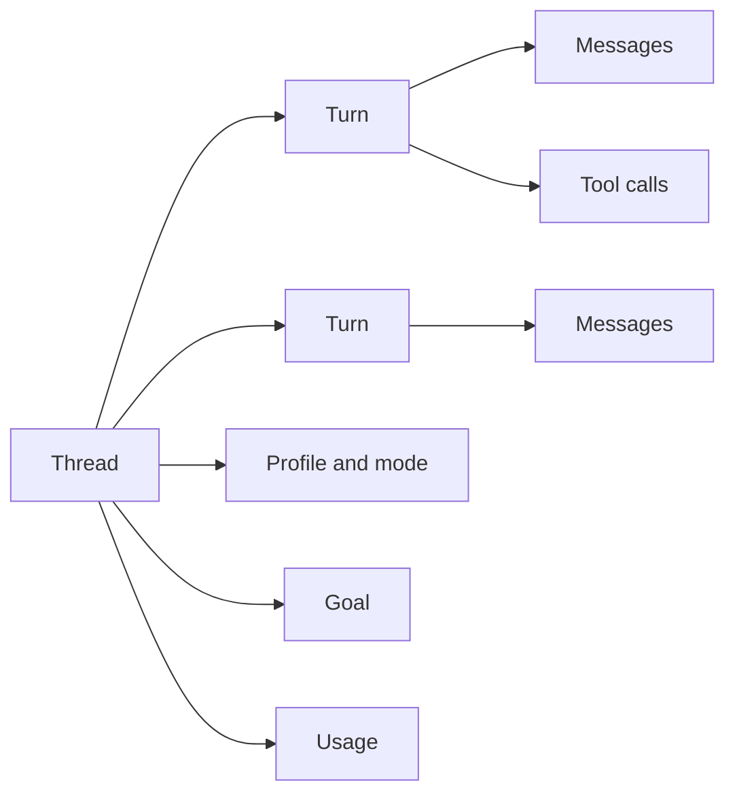
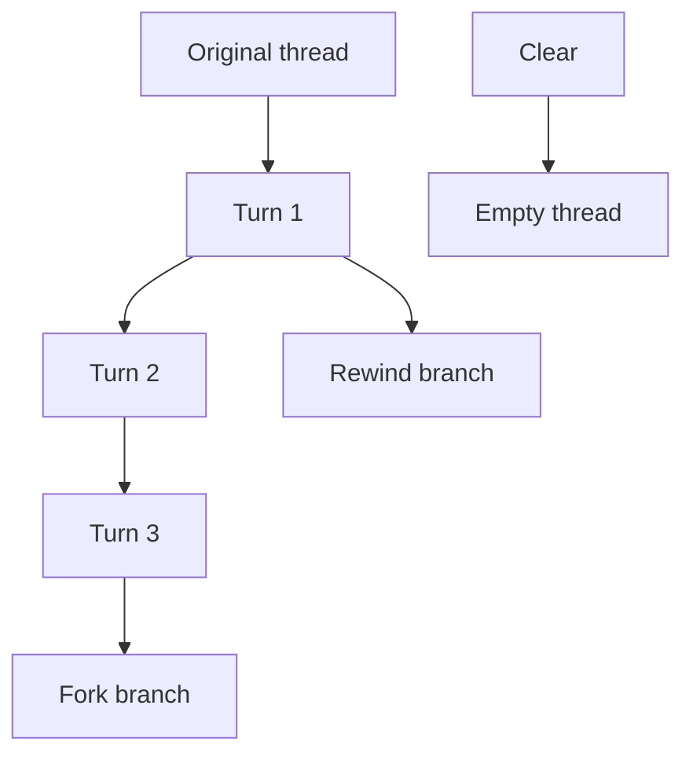
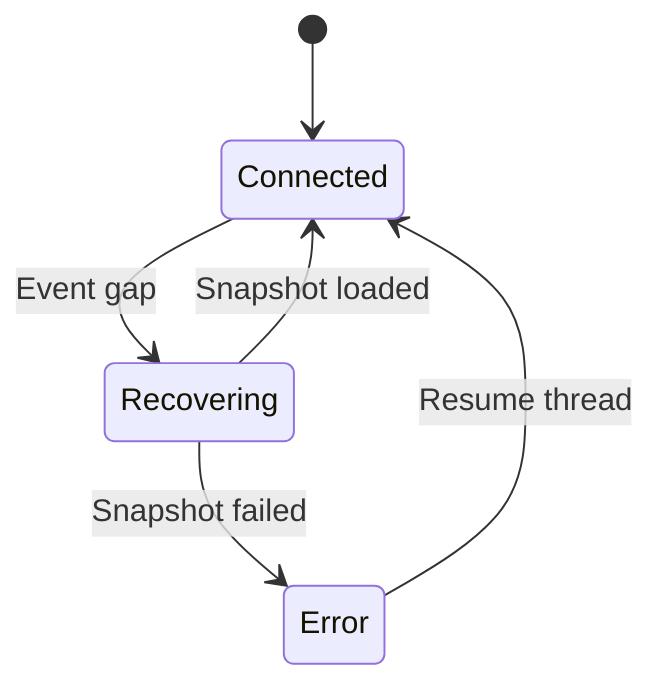

# 会话、模式与上下文

一个代码任务可能跨越多轮对话，也可能需要尝试几条不同的修改路径。ello 使用 Thread 保存
连续上下文，使用 Turn 表示一次执行，并通过模式、分支和压缩控制后续工作。



## 创建和恢复会话

在项目目录中运行 `ello` 会创建一个 Thread：

```bash
ello
```

恢复最近一个未归档的 Thread：

```bash
ello resume
```

查看会话 ID 并恢复指定 Thread：

```bash
ello sessions
ello resume <threadId>
```

TUI 内使用 `/resume` 打开当前工作目录的会话列表。方向键移动，`Enter` 切换。TUI 会清理
当前终端显示，再从目标 Thread 的完整记录重建历史、运行状态和待处理请求。每个 Thread
使用独立的界面状态，前一个 Thread 的历史和输入草稿不会带入目标 Thread。

## 选择会话模式

会话模式控制工具调用的基础权限。初次使用建议保留 `ask-before-changes`，逐项检查写入和
命令请求。

| 模式                 | 行为摘要                                      | 适用场景                   |
| -------------------- | --------------------------------------------- | -------------------------- |
| `ask-before-changes` | 读取自动执行，编辑、Shell 和网络通常请求审批  | 日常开发和初次使用         |
| `accept-edits`       | 工作区内编辑自动执行，Shell 和网络通常审批    | 连续修改已确认的项目       |
| `plan`               | 允许调查并生成计划，业务文件和 Shell 保持受限 | 修改前的方案调查与审阅     |
| `bypass`             | 工具自动执行                                  | 已隔离且影响范围受控的环境 |

`Shift+Tab` 按以下顺序循环：

```text
ask-before-changes → accept-edits → plan → ask-before-changes
```

全局配置启用 `bypass_enabled` 后，循环中会在 `plan` 后加入 `bypass`。也可以直接输入：

```text
/mode ask-before-changes
/mode accept-edits
/mode plan
```

底部状态栏显示当前模式。模式会保存到 Thread，后续 Turn 继续使用。完整权限表和规则配置见
[权限与审批](../permission/README.md)。Plan 的审阅流程见 [Plan 模式](../plan/README.md)。

## 新会话、分支和回退

这些操作对历史的处理方式不同：

| 操作      | 新 Thread | 保留原 Thread  | 新 Thread 的起点                   |
| --------- | --------- | -------------- | ---------------------------------- |
| `/clear`  | 是        | 已有内容时保留 | 空白历史                           |
| `/fork`   | 是        | 是             | 当前历史，或参数指定的 Turn        |
| `/rewind` | 是        | 是             | 所选旧输入之前，并把该输入放回草稿 |
| `/resume` | 否        | 是             | 已保存 Thread 的最新状态           |

`/clear` 适合开始无关任务。已有历史的原 Thread 仍可通过 `/resume` 或
`ello resume <threadId>` 找回；刚创建且没有 Turn 的空 Thread 会被清理。

`/fork` 复制当前路径并切换到新的 Thread，适合从相同上下文尝试另一种方案。提供 Turn ID 时，
分支从该 Turn 截止位置开始。

`/rewind` 打开旧用户输入列表。选择一项后，ello 在对应 Turn 处创建分支，并把原输入填回
Composer。用户可以修改后重新提交，原 Thread 的历史保持不变。



## 控制上下文大小

长会话会积累模型消息和工具结果。`/compact` 启动当前 Thread 的上下文压缩，把较早内容
整理成 checkpoint，后续 Turn 使用压缩后的模型输入。终端历史和 Thread 记录仍可回放。

```text
/compact
```

压缩适合已经完成一个阶段、准备继续后续工作时使用。请求级裁剪和 Thread checkpoint 的
区别见 [上下文压缩](../compact/README.md)。

`/export` 导出当前 Thread。默认格式为 Markdown，也可以指定 HTML 或 JSONL：

```text
/export
/export html
/export jsonl
```

较小的导出会直接显示内容；较大的导出保存为 Artifact，并在历史中显示 Artifact ID 和
字节数。

## 中断和退出

`Ctrl+C` 和 `Esc` 都可以中断正在运行的 Turn。两者在空闲状态下的行为不同：

| 操作                    | 结果               |
| ----------------------- | ------------------ |
| 输入框有草稿时 `Ctrl+C` | 清空草稿           |
| 输入框为空时 `Ctrl+C`   | 关闭当前连接并退出 |
| 普通面板打开时 `Esc`    | 关闭面板           |
| Turn 运行时 `Esc`       | 中断 Turn          |
| `/quit` 或 `/exit`      | 关闭当前连接并退出 |

已产生的消息和工具结果保留在 Thread 中。下次恢复时，TUI 会从 Server 保存的状态重建显示。

## 连接中断后的恢复

Server 为 Thread 通知分配连续序号。TUI 发现通知缺口时会把当前投影视为待恢复状态，并请求
完整 snapshot。恢复期间，新任务提交会暂停，避免基于缺失的历史启动 Turn。



snapshot 加载成功后，TUI 清理旧 scrollback 并重放当前 Thread。运行中的工具、未完成的
审批和用户问题也从 snapshot 恢复。

自动恢复持续失败时，可以退出 TUI 后重新连接：

```bash
ello sessions
ello resume <threadId>
```

远程 App Server 还需要确认 endpoint 和认证环境变量仍然可用。Client projection、通知序号
和 snapshot barrier 的实现说明见 [Coding Agent TUI 设计稿](ello-tui-design.md)。
