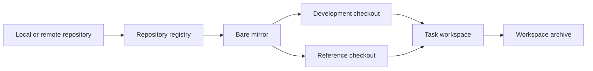

# Workspace 工作区

一个开发任务可能同时修改多个仓库，并需要查阅额外的参考仓库。直接在各仓库的常用目录中切换分支，会把任务分支、临时文件和参考代码分散到不同位置，也难以统一归档。

**Workspace** 为一个任务创建独立目录。开发仓库、参考仓库、任务文档和临时文件都放在该目录中；Git mirror 保存仓库数据，SQLite 记录 Workspace 与 checkout 的关系。



## 为什么需要 Workspace？

跨仓库任务有三类需要同时管理的状态：

- 每个仓库用于开发的分支和提交。
- 仅用于查阅的仓库版本。
- 任务级的文档、临时文件、终端会话和归档记录。

Workspace 使用一个 selector 标识任务，例如 `feature/search-page`。同一 Workspace 中的开发仓库使用相同的任务分支名，参考仓库使用 detached checkout。任务结束后，整个目录可以归档或删除。

| 概念                 | 用户看到的标识      | 用途                                |
| -------------------- | ------------------- | ----------------------------------- |
| Repository           | `web`、`api` 等 key | 可被多个 Workspace 使用的已登记仓库 |
| Workspace            | `<kind>/<name>`     | 一项任务及其全部目录和 checkout     |
| Development checkout | `repos/<key>`       | 编写、提交任务代码                  |
| Reference checkout   | `references/<key>`  | 固定版本的参考代码                  |
| Bare mirror          | 内部 UUID 路径      | 保存 Git refs，并创建各个 worktree  |

## 选择 Workspace 类型

类型参与目录名和分支名。`name` 会转换为小写 slug，例如 `Search Page` 转换为 `search-page`。

| 类型       | 适用任务         | Checkout               |
| ---------- | ---------------- | ---------------------- |
| `feature`  | 增加功能         | `feature/<name>` 分支  |
| `fix`      | 修复缺陷         | `fix/<name>` 分支      |
| `refactor` | 重构代码         | `refactor/<name>` 分支 |
| `explore`  | 阅读、调研或实验 | detached checkout      |

`feature`、`fix` 和 `refactor` 会在每个开发仓库中使用同名分支。Git 仍分别保存各仓库中的分支和提交。

## 第一次使用

### 登记仓库

Workspace 从 repository registry 选择仓库。客户端通过 App Server 的 `repo/add` 方法登记本地目录或远端 URL，并为仓库分配稳定的 key。命令行中的 `workspace create` 从已登记的 key 开始工作。

登记完成后可以查看或同步仓库：

```bash
ello repo list
ello repo read web
ello repo fetch web
```

`repo fetch` 更新 mirror 中的远端记录和 Workspace 起点。已有任务分支保持当前提交，新的任务分支和 detached checkout 使用更新后的起点。

### 创建任务目录

```bash
ello workspace create feature/search-page web api --tmux
ello workspace show feature/search-page
ello workspace path feature/search-page
```

`--tmux` 创建与 Workspace 绑定的 tmux session。省略该参数时只创建目录和 checkout。

默认配置 `workspace.mount: ~/.ello` 产生以下布局：

```text
~/.ello/
├── mirrors/<repository-id>/
├── workspace/feature/search-page/
│   ├── repos/
│   │   ├── web/
│   │   └── api/
│   ├── references/
│   ├── docs/
│   └── tmp/
└── archive/
```

| 目录          | 内容                           |
| ------------- | ------------------------------ |
| `repos/`      | 参与任务开发的 Git worktree    |
| `references/` | detached 参考仓库              |
| `docs/`       | 跨仓库设计、调研结果和任务说明 |
| `tmp/`        | 任务期间生成的临时文件         |

自定义 `workspace.mount` 时需要使用绝对路径或 `~/...` 路径。活动目录位于 `<mount>/workspace`，归档目录位于 `<mount>/archive`。

### 增加开发仓库或参考仓库

```bash
ello workspace repo add worker --workspace feature/search-page
ello workspace repo add sdk --workspace feature/search-page --detached
ello workspace repo create scratch --workspace feature/search-page
```

普通 `repo add` 把仓库放入 `repos/`，并使用 Workspace 的任务分支。`--detached` 把仓库放入 `references/`，提交位置固定在添加时的 baseline。`repo create` 登记一个带初始提交的本地仓库，并将它作为开发仓库加入当前 Workspace。

### 检查并结束任务

```bash
ello workspace status feature/search-page
ello workspace archive feature/search-page
ello workspace archived feature/search-page
```

归档要求所有 checkout 都处于 clean 状态。归档会结束绑定的 tmux session、记录每个 checkout 的 HEAD、切换为 detached 状态，并把完整 Workspace 移到 `archive/`。

需要释放磁盘空间时可以删除活动或归档 Workspace：

```bash
ello workspace delete feature/search-page
ello workspace delete feature/search-page --archived
```

默认删除同样要求 clean。`--force` 会丢弃未提交内容，适合用户已确认可以清理的目录。

## Git 数据放在哪里

Workspace 目录提供可编辑的 worktree。分支、提交、标签和 worktree 登记保存在 bare mirror 中；SQLite 保存 repository key、Workspace selector、路径、角色和状态。

手工移动或删除 Workspace 目录后，三处记录可能出现偏差。`status` 用于即时检查，`reconcile` 保存诊断结果，`repair` 根据 Git refs 和 SQLite 记录恢复受管目录。

```bash
ello workspace status feature/search-page
ello workspace reconcile feature/search-page
ello workspace repair feature/search-page
```

## 深入阅读

- [仓库登记与 baseline](repository-mirror-and-baseline.md)：repository key、bare mirror、远端同步和 checkout 起点。
- [生命周期、诊断与修复](workspace-lifecycle-and-repair.md)：创建、归档、删除、状态观测和 repair 边界。
