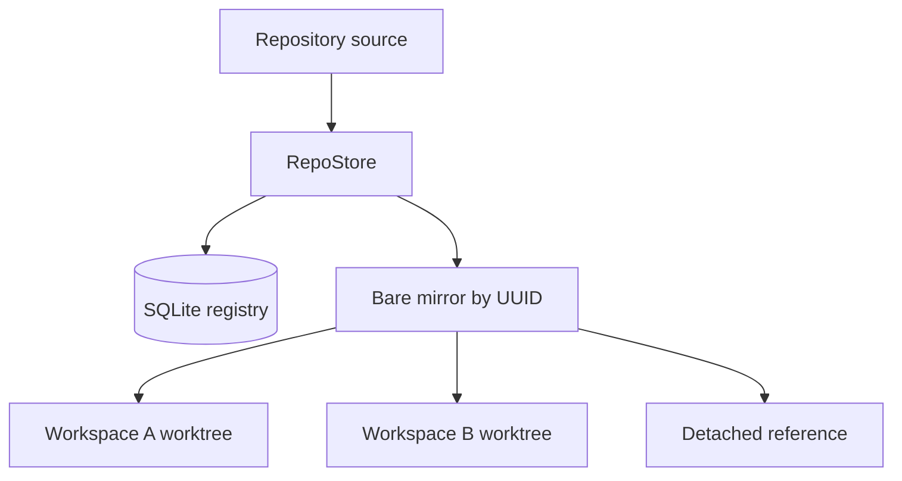
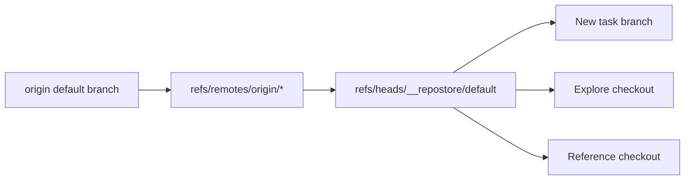
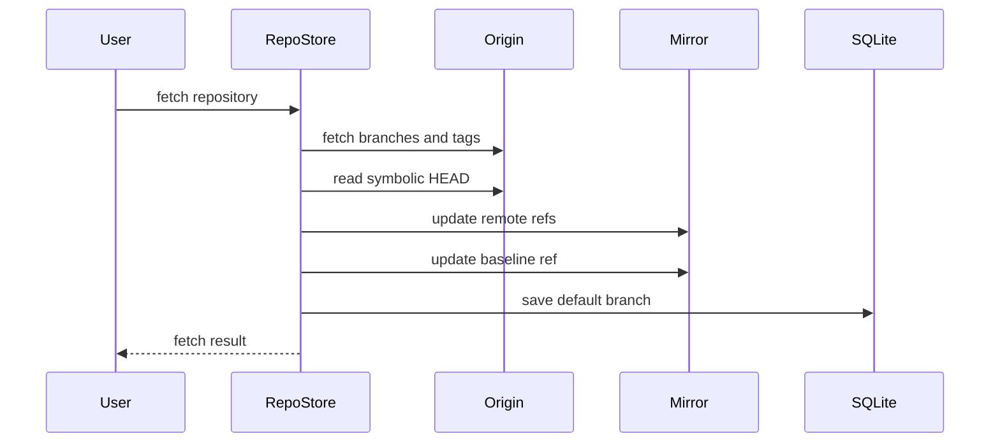

# 仓库登记与 baseline

## 为什么 Workspace 先登记仓库？

同一个仓库可以参与多个任务。每个任务都需要独立 worktree，同时共享提交、标签和远端分支。Workspace 还需要稳定的仓库标识，以便仓库改名后继续找到已有 checkout。

**Repository registry** 为每个仓库保存 key、内部 UUID、mirror 路径、远端 URL 和默认分支。`RepoStore` 负责登记和同步仓库，`WorkspaceStore` 只从登记结果创建 checkout。

| 字段            | 示例                    | 作用                       |
| --------------- | ----------------------- | -------------------------- |
| `key`           | `web`                   | 用户和 RPC 使用的仓库名    |
| `id`            | UUID                    | mirror 的稳定目录名        |
| `mirrorPath`    | `~/.ello/mirrors/<id>`  | Git refs 和对象的存储位置  |
| `remoteUrl`     | `https://...` 或 `null` | `origin` 来源              |
| `defaultBranch` | `main`                  | 最近一次识别出的默认分支名 |

重命名仓库只更新 key。内部 UUID 和 mirror 路径保持稳定，已有 Workspace 通过 repository ID 继续关联同一个仓库。

## 三种仓库来源

`repo/add` 根据 `source` 判断本地路径和远端 URL。Workspace 也可以创建一个由 ello 管理的新仓库。

| 来源               | Mirror 初始化                            | `remoteUrl` | Baseline 来源    |
| ------------------ | ---------------------------------------- | ----------- | ---------------- |
| 本地 Git 目录      | `git clone --mirror` 后移除临时 `origin` | `null`      | 来源目录当前分支 |
| 远端 URL           | 初始化 bare repo，添加 `origin` 并 fetch | URL         | 远端默认分支     |
| Workspace 新建仓库 | 初始化 bare repo 和空树初始提交          | `null`      | 初始提交         |

本地目录和远端仓库都需要至少一个提交。`RepoStore` 保留 `__repostore` 和 `__repostore/*` 命名空间，用户分支使用其他名称。

## Baseline 如何隔离远端更新

**Baseline ref** `refs/heads/__repostore/default` 指向创建新 checkout 时使用的提交。它把“远端当前默认分支”和“用户任务分支”分开维护。

Mirror 中的 refs 分为三组：

| Ref                              | 写入方                  | 用途               |
| -------------------------------- | ----------------------- | ------------------ |
| `refs/remotes/origin/*`          | `repo fetch`            | 记录远端分支       |
| `refs/heads/__repostore/default` | `RepoStore`             | 新 checkout 的起点 |
| 其他 `refs/heads/*`              | Workspace 中的 Git 操作 | 用户任务分支       |

### 远端同步

`RepoStore.fetch()` 调用 `syncOrigin()` 完成一次同步：

同步会执行以下更新：

- 使用 `--prune` 清理远端已删除的分支和标签记录。
- 从远端 `HEAD` 读取默认分支名称。
- 将远端默认分支的提交写入 baseline。
- 更新 `refs/remotes/origin/HEAD` 和 SQLite 中的 `defaultBranch`。

已有用户分支保持原提交，已有 Workspace 保持当前 checkout。新的任务分支和 detached checkout 使用更新后的 baseline。远端默认分支改名也遵循相同规则。

## Checkout 如何创建

`WorkspaceStore.attachRepo()` 根据 Workspace 类型和仓库角色选择 branch 或 detached checkout。

| 场景                                    | 目录               | Git 状态             | 起点                                 |
| --------------------------------------- | ------------------ | -------------------- | ------------------------------------ |
| `feature`、`fix`、`refactor` 的开发仓库 | `repos/<key>`      | `<kind>/<name>` 分支 | 已有同名分支，或 baseline 上的新分支 |
| `explore` 的开发仓库                    | `repos/<key>`      | detached HEAD        | baseline                             |
| Reference 仓库                          | `references/<key>` | detached HEAD        | baseline                             |

开发分支创建后会清除 upstream 配置。用户首次 push 时显式选择远端分支；远端同步的写入范围限于 remote refs、baseline 和默认分支元数据，任务分支的 push 目标保持不变。

多个开发仓库使用相同的分支名称，例如都使用 `feature/search-page`。每个 bare mirror 独立保存自己的同名分支。

## 仓库导入与导出

`RepoStore.export()` 生成 `repos.yaml`，并根据远端状态选择携带方式：

- 带远端的仓库记录 URL 和默认分支。
- 本地仓库生成 Git bundle，并在文档中记录 bundle 相对路径。
- 含凭证的远端 URL 会停止导出，防止凭证进入导出文件。

`RepoStore.import()` 在写入前检查 key 重复、已有 key 冲突、bundle 路径和条目格式。批量导入中途失败时，已经导入的仓库按逆序清理。Bundle 路径限制在导入目录内。

## 源码入口

- [`RepoStore`](../../packages/ello-agent/src/features/workspace/repositories.ts)：仓库登记、远端同步、baseline 和导入导出。
- [`WorkspaceStore`](../../packages/ello-agent/src/features/workspace/workspaces.ts)：branch 与 detached worktree 创建。
- [`planWorkspaceRepo()`](../../packages/ello-agent/src/features/workspace/plan.ts)：checkout 路径、角色和模式规划。
- [Workspace 测试](../../packages/ello-agent/tests/workspace/workspace.test.ts)：同步、分支隔离、reference 和 bundle 契约。
