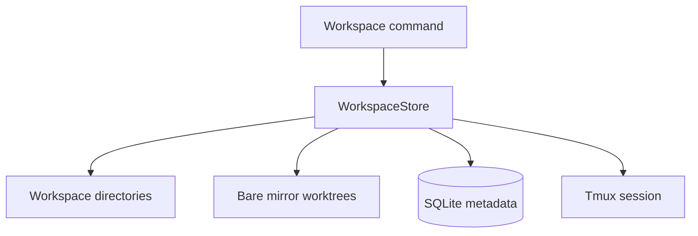
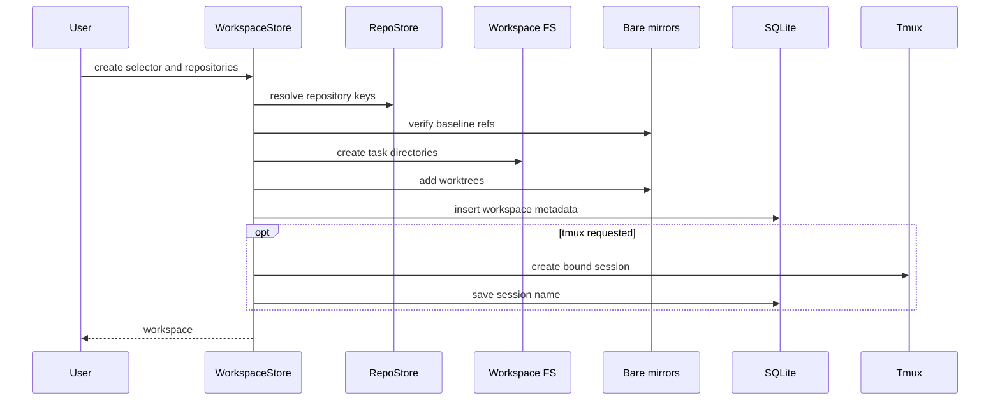
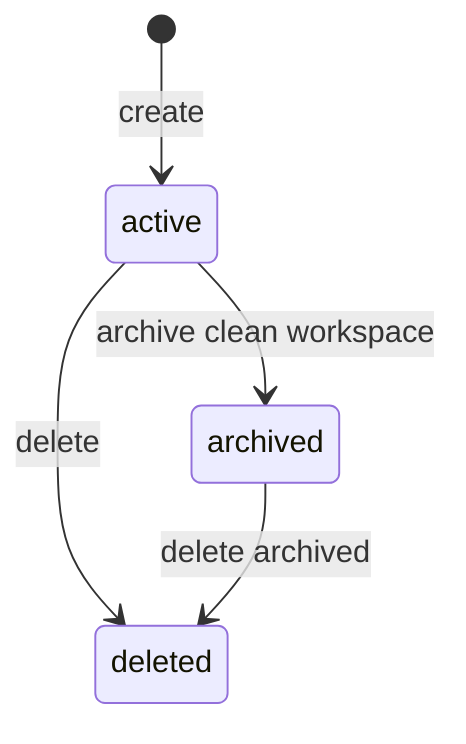
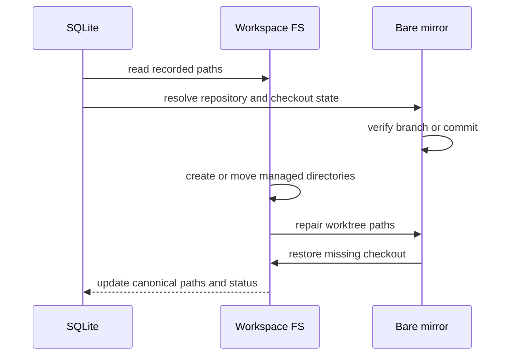

# 生命周期、诊断与修复

## 为什么生命周期需要统一管理？

一个 Workspace 同时存在于文件系统、Git mirror、SQLite 和可选的 tmux session 中。重命名、归档或删除目录时，Git worktree 路径和数据库记录也要同步更新。手工移动目录会让这些记录产生偏差。

**WorkspaceStore** 统一执行目录、worktree、元数据和 tmux 操作。日常管理通过 Workspace 命令完成，路径异常通过 `status`、`reconcile` 和 `repair` 处理。



## 创建 Workspace

Workspace selector 由类型和名称组成。`planWorkspaceCreate()` 校验类型、规范化名称、检查 repository key 重复，并计算根目录和任务分支。

```ts
return {
  kind,
  name: slug,
  rootPath: input.rootPath,
  branch: kind === 'explore' ? null : `${kind}/${name}`,
  repoKeys,
};
```

创建过程按依赖顺序执行：



`feature`、`fix` 和 `refactor` 为每个开发仓库创建 `<kind>/<name>` 分支。`explore` 创建 detached checkout。根目录同时创建 `repos/`、`references/`、`docs/` 和 `tmp/`。

## 活动 Workspace 操作

| 目的           | 命令                                                               | 产生的变化                                              |
| -------------- | ------------------------------------------------------------------ | ------------------------------------------------------- |
| 查看元数据     | `ello workspace show <selector>`                                   | 只读取 SQLite 记录                                      |
| 查看根目录     | `ello workspace path <selector>`                                   | 输出规范化绝对路径                                      |
| 检查文件和 Git | `ello workspace status <selector>`                                 | 读取目录与 `git status --porcelain`                     |
| 增加开发仓库   | `ello workspace repo add <repo> --workspace <selector>`            | 创建任务分支 worktree                                   |
| 增加参考仓库   | `ello workspace repo add <repo> --workspace <selector> --detached` | 创建 detached reference                                 |
| 重命名         | `ello workspace rename <selector> <name>`                          | 移动根目录、修复 worktree 路径、更新 tmux 名称和 SQLite |
| 绑定 tmux      | `ello workspace tmux new <selector>`                               | 在 Workspace 根目录创建 session                         |

重命名会更新 selector 名称、根目录和 tmux session 名称。各仓库继续使用创建 Workspace 时的任务分支名。

移除仓库和删除 Workspace 默认检查 dirty 状态。`--force` 会让 Git 丢弃受管 worktree 中的未提交内容。

## 归档与删除

Workspace 的正常状态转换由三个操作构成：



`missing` 保留给旧数据和迁移记录。当前 `status` 与 `reconcile` 把路径缺失记录为观测结果，同时保留 Workspace 原状态；`repair` 会把旧 `missing` 记录恢复为活动或归档状态。

### 归档

`archive()` 先检查所有 checkout 都处于 clean 状态，再执行以下操作：

- 结束绑定的 tmux session。
- 读取每个 checkout 的 HEAD commit。
- 将 branch checkout 切换为 detached HEAD。
- 把根目录移动到 `archive/<kind>/<name>-<timestamp>-<id>`。
- 调用 `git worktree repair` 更新各个 mirror 中的路径。
- 将新路径、HEAD 和 `archived` 状态写入 SQLite。

归档保留完整 checkout、`docs/` 和 `tmp/`。归档后的分支引用可以被同 selector 的新 Workspace 使用；归档 checkout 继续固定在归档时的提交。

同一个 selector 可以产生多代归档。存在多代记录时，按 Workspace ID 选择具体归档。

### 删除

`delete()` 结束 tmux session，通过各个 mirror 移除 worktree，删除 Workspace 根目录，再把 SQLite 状态更新为 `deleted`。默认模式要求 clean，`--force` 跳过 dirty 检查。

`deleted` 是终止状态并保留在 SQLite 中，位于 `repair` 的输入范围之外。仍被活动或归档 Workspace 引用的 repository 也会保留在 registry 中。

## `status`、`reconcile` 和 `repair`

三个操作承担不同职责：

| 操作        | 读取内容                                   | 写入内容                       | 适用场景                                  |
| ----------- | ------------------------------------------ | ------------------------------ | ----------------------------------------- |
| `status`    | 根目录、checkout、Git dirty 状态和读取错误 | 无                             | 查看一个 Workspace 的即时状态             |
| `reconcile` | 与 `status` 相同                           | `workspace_sync_runs` 诊断记录 | 保存一个或全部可修复 Workspace 的检查结果 |
| `repair`    | SQLite 路径、Git worktree 元数据和 refs    | 目录、worktree 元数据、SQLite  | 恢复被移动或删除的受管内容                |

`reconcile` 的 `fixedCount` 为 `0`。它记录 `active`、`missing`、`dirty` 或 `invalid` checkout 观测结果，并保留现场供用户检查。

### Repair 的执行顺序

`repair()` 先验证恢复依据，再修改文件系统。每个 Workspace 独立处理。



| 偏差                   | Repair 行为                                          |
| ---------------------- | ---------------------------------------------------- |
| 根目录缺失             | 创建规范根目录和四个固定子目录                       |
| 根目录记录偏离规范路径 | 将已有根目录移动到规范路径                           |
| Checkout 路径变化      | 移动 checkout，并修复 mirror 中的 worktree 路径      |
| Checkout 缺失          | 从记录的 branch 或 detached commit 重新创建 worktree |
| 旧 `missing` 状态      | 根据路径位置恢复为 `active` 或 `archived`            |
| SQLite 路径过期        | 文件系统操作完成后更新数据库                         |

Repair 遇到以下情况会停止当前 Workspace：

- `repos/` 或 `references/` 中存在 registry 未管理的目录。
- 记录的分支或 detached commit 已经丢失。
- 目标路径已有普通目录或来源不匹配的 Git checkout。
- Workspace 状态为 `deleted`。

这些条件保留现场，由用户确认目录和 refs 后再次运行 repair。

## 建议的排查顺序

```bash
ello workspace status feature/search-page
ello workspace reconcile feature/search-page
ello workspace repair feature/search-page
ello workspace status feature/search-page
```

先查看即时状态，再保存诊断记录。确认缺失目录属于受管内容后执行 repair，最后重新检查 Git dirty 状态和路径。

省略 selector 时，`reconcile` 和 `repair` 会处理全部 `active`、`archived` 和旧 `missing` 记录。

## 源码入口

- [`WorkspaceStore`](../../packages/ello-agent/src/features/workspace/workspaces.ts)：创建、重命名、归档、删除、状态和 repair。
- [`WorkspaceRecordStore`](../../packages/ello-agent/src/features/workspace/store.ts)：Workspace 与 checkout 的 SQLite 记录。
- [`planWorkspaceCreate()`](../../packages/ello-agent/src/features/workspace/plan.ts)：selector、路径和分支规划。
- [Workspace 测试](../../packages/ello-agent/tests/workspace/workspace.test.ts)：生命周期、dirty 保护、归档版本和 repair 契约。
