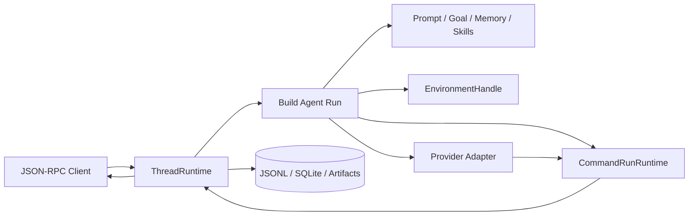

# @ello/agent

<p align="center"><a href="../../README-en.md">Project home</a> · <a href="README.md">简体中文</a> · <strong>English</strong></p>

`@ello/agent` is Ello's App Server and execution kernel. It owns provider credentials, model calls, the Command runtime, permissions, Threads, persistence, Agent features, and Environment lifecycles. Clients use those capabilities only through versioned JSON-RPC.

## Responsibility boundary

| Server-owned                                         | Client responsibility                                   |
| ---------------------------------------------------- | ------------------------------------------------------- |
| Providers, credentials, and model execution          | Render state and submit typed requests                  |
| Thread/Turn/Command durable state                    | Never treat UI state as the source of truth             |
| Command Catalog, permissions, approvals, checkpoints | Never execute files, processes, or MCP tools directly   |
| JSONL, SQLite, artifacts, and usage                  | Never write Server state outside the protocol           |
| Environment, tracing, and resource shutdown          | Manage only the Client connection and interaction state |

This boundary lets the TUI, headless CLI, benchmark runner, and remote clients share one Agent implementation.

## Turn lifecycle



A run resolves its Agent definition and model, attaches an Environment Handle, builds bounded runtime context, and calls the provider with exactly one visible Tool: `command_run`. Command results and state transitions are persisted before they are projected to clients. Tracing and Environment resources close in reverse ownership order.

## Command runtime

`CommandRunRuntime` owns strict batch compilation, the dynamic Command Catalog, stable command identity, step barriers, effect-aware scheduling, permissions, failure barriers, deferred interactions, checkpoints, resume, audit results, and bounded model observations.

Core features and MCP capabilities are internal Commands. Provider adapters only translate and replay a legal outer `command_run` call/result pair.

## Agent features

| Feature            | Purpose                                                                          |
| ------------------ | -------------------------------------------------------------------------------- |
| Memory             | Durable private/team knowledge indexed and loaded on demand                      |
| Goal               | One Thread-bound objective, lifecycle state, and optional token budget           |
| Skills             | Global/project instruction catalog with explicit per-run activation              |
| Subagents          | Persistent child tasks with isolated prompt, transcript, usage, and cancellation |
| Context Compaction | Compressed provider-history projection while the full Thread log remains durable |
| MCP                | Remote tools adapted into the same Command, permission, and audit path           |
| Task               | Durable work-item state, ownership, dependencies, and claims                     |
| Plan Mode          | Persisted, hash-checked plans with side effects restricted before acceptance     |
| Session Mode       | Server-owned Plan, approval, edit-accepting, and optional bypass posture         |
| Permissions        | Per-Command allow, approval, or deny decisions from mode, path, and scoped rules |

These mechanisms separately cover durable knowledge, objectives, work tracking, execution contexts, context compaction, planning, and authorization.

## Client-Server protocol

The App Server supports stdio, WebSocket, and Unix socket transports. `vscode-jsonrpc` owns generic correlation and cancellation; Ello owns protocol versioning, Zod validation, capabilities, route permissions, response-before-notification ordering, bounded backpressure, and durable Server Request IDs.

See [Client-Server architecture](../../docs/agent/client-server-architecture.md) and [protocol documentation](../../docs/protocol/README.md).

## Inverted Environment execution

The Agent engine does not import Node filesystem, `child_process`, or Docker. It depends on `Environments.attach(location, grant)`, which returns an `EnvironmentHandle` with filesystem, process, instruction, and close capabilities.

Local production uses the host adapter. The benchmark package supplies a container adapter through the same `@ello/agent/runtime` contract. Opaque process references, bounded output, handle ownership, generations, and a shared/exclusive execution gate keep lifecycle and concurrency policy below the Agent and Command layers.

## Public entry points

| Export                     | Purpose                                                |
| -------------------------- | ------------------------------------------------------ |
| `@ello/agent`              | `createApp`, `AgentServer`, and lifecycle types        |
| `@ello/agent/protocol`     | JSON-RPC v1 schemas and resources                      |
| `@ello/agent/runtime`      | Environment, AgentRuntime, tracing, and listener ports |
| `@ello/agent/server-entry` | Standalone App Server executable                       |

## Build and inspect

```bash
pnpm --filter @ello/agent build
node packages/ello-agent/dist/main.js --listen stdio://

pnpm --filter @ello/agent run prompt:show -- \
  --profile rapid \
  --mode ask-before-changes \
  --cwd "$PWD"
```

## Validation

```bash
pnpm --filter @ello/agent test
pnpm --filter @ello/agent typecheck
pnpm --filter @ello/agent lint
pnpm --filter @ello/agent build
pnpm --filter @ello/agent verify-dist
```

More detail: [Agent runtime](../../docs/agent/README.md), [Command scheduling](../../docs/tools/tool-scheduler.md), [context compaction](../../docs/compact/README.md), [tasks](../../docs/task/README.md), [Plan Mode](../../docs/plan/README.md), [permissions](../../docs/permission/README.md), and [features](../../docs/README.md).
