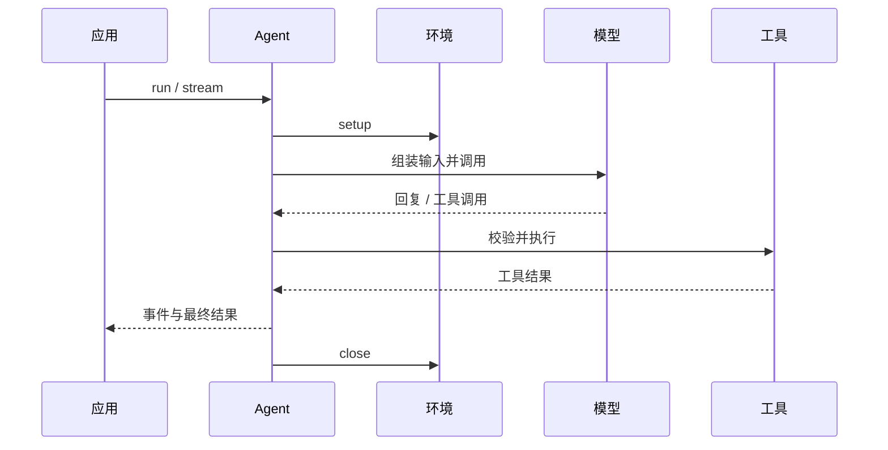

# @ello/agent

`@ello/agent` 是 ello 的 provider 无关 Agent 运行时 SDK。它提供一个小而稳定的接口来执行模型与工具循环，不绑定 UI，也不预设产品层能力。

## 能力

- `createAgent()`，以及 `run()`、`stream()`、`resume()`、`close()`
- 使用 `defineTool()` 和 Zod schema 定义类型安全工具
- 本地文件系统、Shell 和资源注册表环境
- AI SDK provider 模型适配器
- 会话、消息转换、system sections、审批、observer、用量诊断
- 技能，以及可延迟/可恢复的工具执行

## 安装

```bash
pnpm add @ello/agent
```

## 示例

```ts
import {
  createAgent,
  createLocalShellEnvironment,
  defineTool,
  z,
} from '@ello/agent';

const agent = createAgent({
  model: 'openai:gpt-4.1-mini',
  instructions: '请简洁回答。',
  environment: createLocalShellEnvironment({
    cwd: process.cwd(),
    allowedPaths: [process.cwd()],
  }),
  tools: [
    defineTool({
      name: 'echo',
      description: '返回文本',
      input: z.object({ text: z.string() }),
      execute: ({ text }) => text,
    }),
  ],
});

const result = await agent.run('你好');
console.log(result.output);
await agent.close();
```

`stream()` 与 `run()` 走同一执行路径，会返回事件和最终结果。调用方应持续消费迭代器，以遵守流式事件的背压限制。

## 运行时流程



英文文档见 [`README.md`](README.md)。
