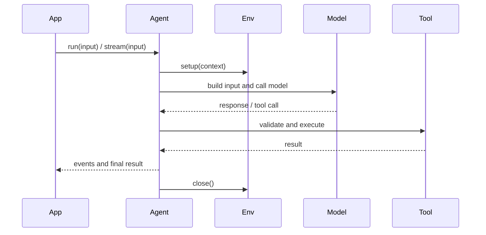

# @ello/agent

`@ello/agent` is ello's provider-agnostic Agent runtime SDK. It gives application code a small, stable surface for running model/tool loops without imposing a UI or product preset.

## Features

- `createAgent()` with `run()`, `stream()`, `resume()`, and `close()`
- Typed tools via `defineTool()` and Zod schemas
- Local filesystem, shell, and resource environments
- Model adapters for AI SDK providers
- Sessions, message transforms, system sections, approvals, observers, and usage diagnostics
- Skills and deferred/resumable tool execution

## Install

```bash
pnpm add @ello/agent
```

## Example

```ts
import {
  createAgent,
  createLocalShellEnvironment,
  defineTool,
  z,
} from '@ello/agent';

const agent = createAgent({
  model: 'openai:gpt-4.1-mini',
  instructions: 'Answer concisely.',
  environment: createLocalShellEnvironment({
    cwd: process.cwd(),
    allowedPaths: [process.cwd()],
  }),
  tools: [
    defineTool({
      name: 'echo',
      description: 'Return text',
      input: z.object({ text: z.string() }),
      execute: ({ text }) => text,
    }),
  ],
});

const result = await agent.run('Hello');
console.log(result.output);
await agent.close();
```

`stream()` follows the same execution path as `run()` and exposes events plus a final result. Consumers should keep consuming the iterator to respect the configured backpressure limit.

## Runtime model



See [`README-zh.md`](README-zh.md) for Chinese documentation.
