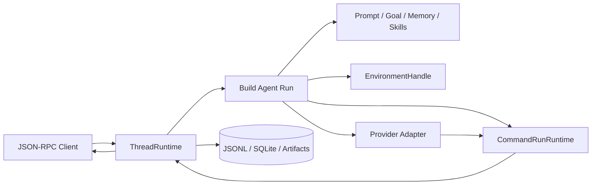

# @ello/agent

<p align="center"><a href="../../README.md">项目首页</a> · <strong>简体中文</strong> · <a href="README-en.md">English</a></p>

`@ello/agent` 是 Ello 的 App Server 和执行内核。它拥有 provider 凭据、模型调用、Command runtime、权限、Thread、存储、Memory、Goal、Skills、Subagent、MCP 与 Environment 生命周期；Client 只能通过 versioned JSON-RPC 使用这些能力。

## Package 边界

| Server 拥有                              | Client 不拥有                        |
| ---------------------------------------- | ------------------------------------ |
| Provider 配置、凭据和模型调用            | 不直接创建模型或访问凭据             |
| Thread/Turn/Command 的 durable state     | 不把 UI state 当作事实源             |
| Command Catalog、权限、审批和 checkpoint | 不直接执行文件、Shell 或 MCP Tool    |
| JSONL、SQLite、artifact 与 usage         | 不绕过协议写 Server 文件             |
| Environment、进程、Tracing 与资源关闭    | 不管理 Server 子进程中的业务生命周期 |

这种边界让 TUI、无界面 CLI、Benchmark 和远程 Client 复用同一个 Agent 内核，而不是各自实现一套工具循环。

## 一次 Turn 的运行路径


```mermaid
flowchart LR
  Client[JSON-RPC Client] --> Thread[ThreadRuntime]
  Thread --> Build[Build Agent Run]
  Build --> Context[Prompt / Goal / Memory / Skills]
  Build --> Env[EnvironmentHandle]
  Build --> Commands[CommandRunRuntime]
  Build --> Model[Provider Adapter]
  Model --> Commands
  Commands --> Thread
  Thread --> Log[(JSONL / SQLite / Artifacts)]
  Thread --> Client
```

1. Thread 从 durable snapshot 接收 `turn/start`。
2. definition、model、provider options 与 prompt profile 被解析。
3. runtime attach 一个绑定 working directory、generation 和 grant 的 Environment Handle。
4. Memory index、Goal、Skills、任务通知和 project instructions 组成有界 model input。
5. provider 只看到一个 `command_run` Tool；内部 Command 完成编译、调度、审批、执行与结果投影。
6. transcript、Command、usage、checkpoint 和状态变化先持久化，再投影给 Client。
7. run 结束后按逆序关闭 tracing、Environment Handle 和其他资源。

## Command Runtime

`CommandRunRuntime` 是深模块，不是旧 Tool executor 外的一层包装。它负责：

- 1 到 32 个 Frame 的严格 schema 与全批编译；
- Command Catalog、类型化 input、稳定 identity 和 payload digest；
- `step` phase barrier、effect-aware scheduling 与 Environment Gate；
- 逐 Command permission/approval；
- fail-fast、`continue`、只读 `diagnose` 和 blocked receipt；
- deferred interaction、持久 checkpoint 与不重放完成前缀的 resume；
- 完整 audit result 与有界 model observation 的不同投影。

核心、MCP 和 Agent Features 都适配为内部 Command。Provider Tool 集保持为 `{ command_run }`，provider adapter 只负责合法 call/result 的协议转换和 replay。

## 核心 Features

| Feature            | Agent 中的职责                                                         |
| ------------------ | ---------------------------------------------------------------------- |
| Memory             | 管理 private/team topic、索引、revision 与按需正文读取                 |
| Goal               | 将一个长期目标、状态和累计 token budget 绑定到 Thread                  |
| Skills             | 加载 global/project catalog，按名称激活 `SKILL.md` 并在 run 内去重     |
| Subagent           | 持久化 child task、独立 run/transcript、usage、取消与主 Agent 通知     |
| Context Compaction | 压缩 provider history 投影，同时保留完整 Thread log                    |
| MCP                | 复用 MCP client 连接，把远端 Tool 转换为经过权限与调度的内部 Command   |
| Task               | 持久化工作项状态、owner、依赖关系与领取操作                            |
| Plan Mode          | 保存并校验计划，在用户接受前限制业务写入和 Shell                       |
| Session Mode       | 持有 `plan`、`ask-before-changes`、`accept-edits` 与可选 `bypass` 状态 |
| Permissions        | 结合 mode、Command、路径和分层规则产生 allow、approval 或 deny 决策    |

这些能力不是同一类“上下文插件”：它们分别处理长期知识、目标、工作清单、执行上下文、上下文压缩、规划与授权。

## Client-Server 协议

App Server 支持 stdio、WebSocket 与 Unix socket。连接生命周期为：

```text
initialize -> initialized -> thread/start | thread/resume -> turn/start
```

`vscode-jsonrpc` 负责 request ID、response correlation、Cancellation 和连接清理；Ello 负责协议版本、capability、Zod schema、route permission、response-before-notification、有界背压和 durable Server Request ID。

审批与用户输入是 Server Request。它们先写入 Thread JSONL，再发给支持对应 capability 的 Client；连接断开后，新 Client 可以从 snapshot 恢复未完成请求，而不是依赖旧连接内存中的 Promise。

详见 [Client-Server 架构](../../docs/agent/client-server-architecture.md) 和 [协议文档](../../docs/protocol/README.md)。

## 依赖倒置的 Environment

Agent engine 不 import Node filesystem、`child_process` 或 Docker。它只依赖 `@ello/agent/runtime` 导出的稳定 contract：

```text
Environments.attach(ExecutionLocation, EnvironmentGrant)
  -> EnvironmentHandle
     -> EnvironmentFileSystem
     -> EnvironmentProcesses
     -> getInstructions()
     -> close()
```

- `EnvironmentReference + generation` 标识一个稳定执行空间。
- Handle 绑定 working directory 和不可扩大的 grant。
- FileSystem 返回普通字节与元数据，不泄漏宿主对象。
- Processes 使用不透明引用，统一 `exec/spawn/inspect/write/wait/signal`、有界输出与进程树关闭。
- generation 级 Gate 允许安全只读共享，修改和未知操作独占。
- Local adapter 使用宿主文件系统与进程 registry；Benchmark adapter 把同一 contract 映射到任务容器。

因此外部宿主可以替换 Environment 和 tracing，而不修改 Agent loop、Command、权限或 Thread。

## 公开入口

| Export                     | 用途                                                    |
| -------------------------- | ------------------------------------------------------- |
| `@ello/agent`              | `createApp`、`AgentServer` 与 Server lifecycle type     |
| `@ello/agent/protocol`     | JSON-RPC v1 schema、method、notification 与资源类型     |
| `@ello/agent/runtime`      | Environment、AgentRuntime、tracing 与 listener 装配端口 |
| `@ello/agent/server-entry` | 独立 App Server executable，供本地 Client 启动          |

## 启动 App Server

```bash
pnpm --filter @ello/agent build
node packages/ello-agent/dist/main.js --listen stdio://
```

通常由 `@ello/tui` 启动本地子进程；长驻服务可以监听 WebSocket 或 Unix endpoint。

显示实际发送给模型的 system prompt 与 provider-visible Tool definition：

```bash
pnpm --filter @ello/agent run prompt:show -- \
  --profile rapid \
  --mode ask-before-changes \
  --cwd "$PWD"
```

## Benchmark 接入

`@ello/bench` 通过 `@ello/agent/runtime` 注入 Container Environment 和 EngineEvent recorder。每个 job 使用独立 Server 进程、state root 和 Unix socket；普通 `ello --remote ... --json --no-tui run` Client 仍走生产协议。任务选择、Docker 调度、verifier 和统计都留在 benchmark package，不进入产品 Agent。

## 开发验证

```bash
pnpm --filter @ello/agent test
pnpm --filter @ello/agent typecheck
pnpm --filter @ello/agent lint
pnpm --filter @ello/agent build
pnpm --filter @ello/agent verify-dist
```

进一步阅读：

- [Agent 模块](../../docs/agent/README.md)
- [Command 调度](../../docs/tools/tool-scheduler.md)
- [Context Compaction](../../docs/compact/README.md)
- [Task](../../docs/task/README.md)
- [Plan Mode](../../docs/plan/README.md)
- [权限与审批](../../docs/permission/README.md)
- [Memory](../../docs/memory/README.md)
- [Goal](../../docs/goal/README.md)
- [Skills](../../docs/skills/README.md)
- [Subagent](../../docs/subagents/README.md)
