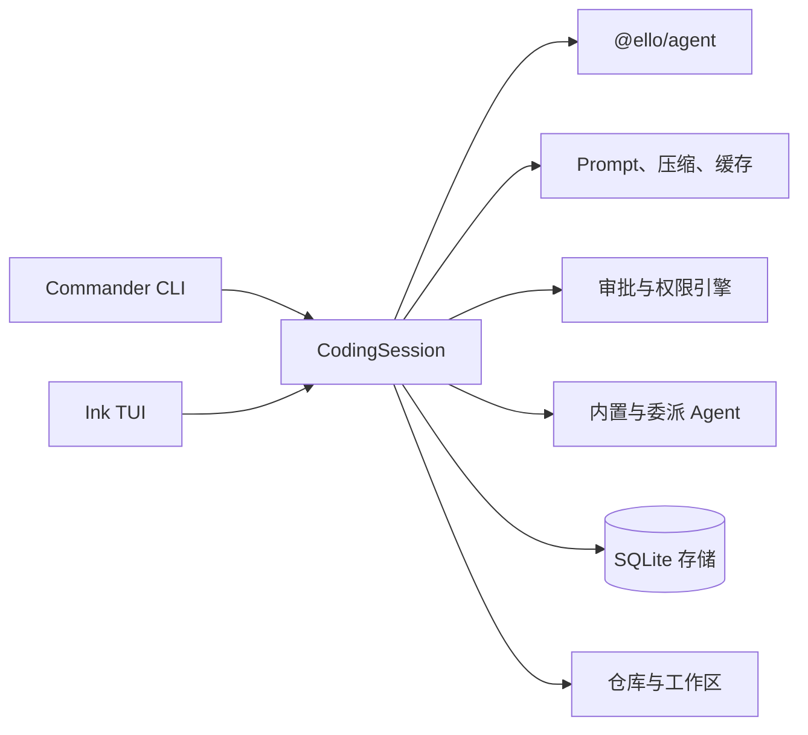

# @ello/coding-agent


`@ello/coding-agent` 是 ello 的开箱即用 coding-agent 产品层。它把 `@ello/agent` 运行时与终端 UI、CLI 工作流、项目配置、安全权限、持久化会话和开发者工具组合在一起。

## 主要能力

- Ink/React 交互式 TUI，同时支持非交互和 JSON 输出
- `run`、`resume` 会话执行
- 会话级 `plan`、`default`、`accept-edits`、`bypass` 四种模式
- Plan artifact 预览及 Accept / Chat about this / Deny 审批流程
- 内置工具和子代理，以及文件优先的全局/项目 Skills、任务板、目标、记忆与仓库/工作区管理
- SQLite 会话、检查点、产物和迁移
- OpenTelemetry/Langfuse 可观测性钩子

## 快速开始

在本 workspace 中运行：

```bash
pnpm install
pnpm --filter @ello/coding-agent build
pnpm --filter @ello/coding-agent run ello --help
```

如需全局开发链接，请先构建，再在本目录执行 `pnpm link --global`，并确认 pnpm 的 global bin 目录已加入 `PATH`。

常用命令：

```bash
ello run "检查当前项目"
ello resume
ello --no-tui --json run "列出失败的测试"
ello config init --project
ello info doctor
ello task list
ello skills list
```

全局选项包括 `--profile`、`--cwd`、`--allowed-path`、`--mode`、`--json` 和 `--no-tui`。provider/model 设置来自用户和项目配置层；使用 `ello config path` 查看配置位置。

Skills 不随本 npm 包发布。请把独立 `ello-skills` release 安装或链接到 `~/.ello/skills`，或放入 `<cwd>/.ello/skills`。`$skill-name [参数]` 会明确要求模型调用 `activate_skill`；自然语言任务也由模型自主判断是否调用同一工具。`/skills` 只打开浏览界面。

## Plan 模式

使用 `Shift+Tab` 循环安全模式，或用 `/mode <模式>` 精确切换。`/plan <任务>` 会进入 Plan 模式并提交任务；Plan 模式中的 `/plan` 预览最新的完整计划，`/plan <反馈>` 则继续讨论和修改。

Plan 模式只允许读取与搜索，业务文件编辑、shell 和网络访问会被稳定拒绝。Agent 只能写入 `.ello/plans/<session-id>.md`。接受计划后，ello 创建一个新的 Default 模式 Execution Session，并以完整计划作为首条用户消息开始执行。`bypass` 还必须通过 `bypass_enabled: true` 显式启用。

## 架构



## 开发

```bash
pnpm --filter @ello/coding-agent typecheck
pnpm --filter @ello/coding-agent test
pnpm --filter @ello/coding-agent lint
```

英文文档见 [`README.md`](README.md)。
