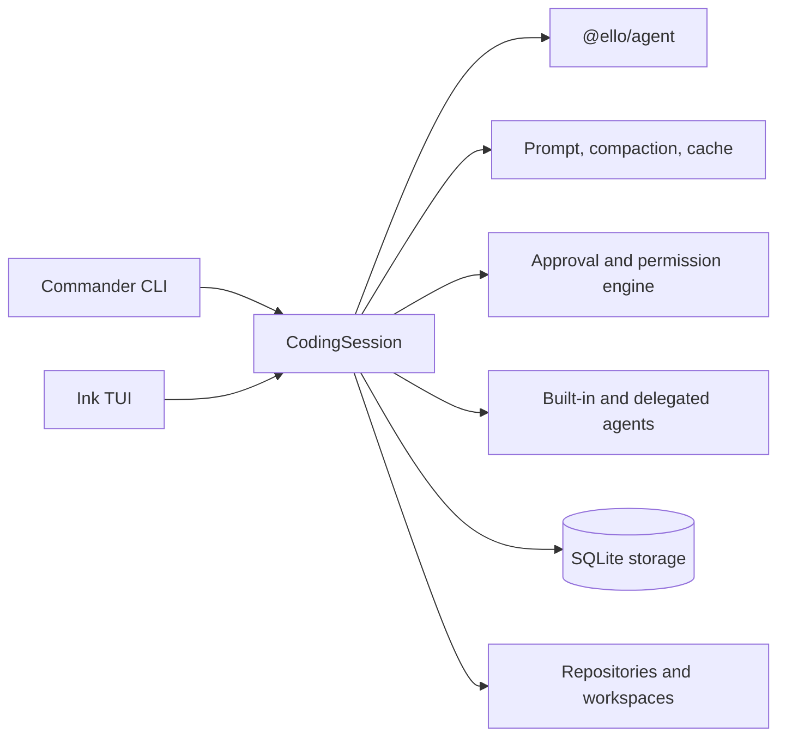

# @ello/coding-agent


`@ello/coding-agent` is ello's batteries-included coding-agent product. It combines the `@ello/agent` runtime with a terminal UI, CLI workflows, project configuration, safe permissions, persistent sessions, and developer productivity tools.

## Highlights

- Interactive Ink/React TUI, plus non-interactive and JSON output
- `run` and `resume` sessions
- Permission and approval modes: `default`, `accept-edits`, `bypass`, `dont-ask`
- Built-in tools, skills, subagents, task boards, goals, memory, and repository/workspace management
- SQLite-backed sessions, checkpoints, artifacts, and migrations
- OpenTelemetry/Langfuse observability hooks

## Quick start

From this workspace:

```bash
pnpm install
pnpm --filter @ello/coding-agent build
pnpm --filter @ello/coding-agent run ello --help
```

For a global development link, build first and run `pnpm link --global` from this package directory. Ensure pnpm's global bin directory is on `PATH`.

Useful commands:

```bash
ello run "Review the current project"
ello resume
ello --no-tui --json run "List the failing tests"
ello config init --project
ello info doctor
ello task list
ello skills list
```

Global options include `--profile`, `--cwd`, `--allowed-path`, `--approval`, `--json`, and `--no-tui`. Provider/model settings are loaded from the project and user configuration layers; use `ello config path` to inspect their locations.

## Architecture



## Development

```bash
pnpm --filter @ello/coding-agent typecheck
pnpm --filter @ello/coding-agent test
pnpm --filter @ello/coding-agent lint
```

See [`README-zh.md`](README-zh.md) for Chinese documentation.
