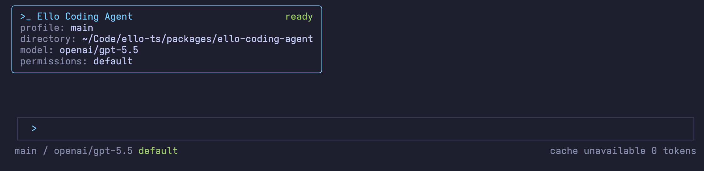
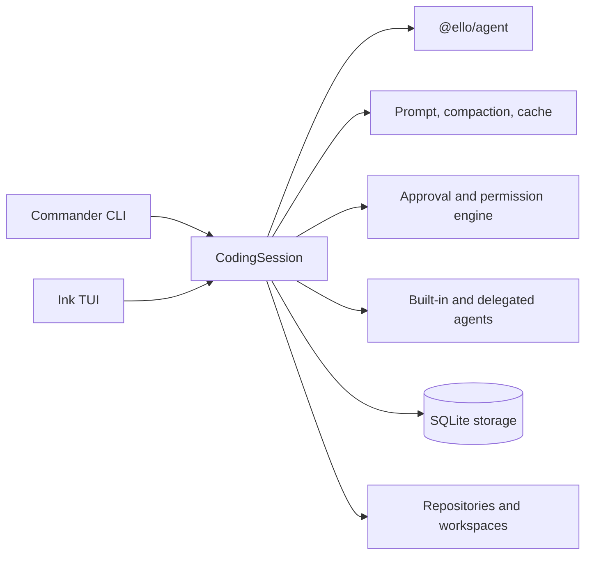

# @ello/coding-agent



`@ello/coding-agent` is ello's batteries-included coding-agent product. It combines the `@ello/agent` runtime with a terminal UI, CLI workflows, project configuration, safe permissions, persistent sessions, and developer productivity tools.

## Highlights

- Interactive Ink/React TUI, plus non-interactive and JSON output
- `run` and `resume` sessions
- Session modes: `plan`, `default`, `accept-edits`, and explicitly enabled `bypass`
- Plan artifact preview and Accept / Chat about this / Deny workflow
- Built-in tools and subagents plus file-first global/project skills, task boards, goals, memory, and repository/workspace management
- SQLite-backed sessions, checkpoints, artifacts, and migrations
- OpenTelemetry/Langfuse observability hooks

## Quick start

From this workspace:

```bash
pnpm install
pnpm --filter @ello/coding-agent build
pnpm --filter @ello/coding-agent run ello --help
```

For a global development link, build first and run `pnpm link --global` from this package directory. Ensure pnpm's global bin directory is on `PATH`.

Useful commands:

```bash
ello run "Review the current project"
ello resume
ello --no-tui --json run "List the failing tests"
ello config init --project
ello info doctor
ello task list
ello skills list
```

Global options include `--profile`, `--cwd`, `--allowed-path`, `--mode`, `--json`, and `--no-tui`. Provider/model settings are loaded from the project and user configuration layers; use `ello config path` to inspect their locations.

Skills are not shipped in this npm package. Install or link the standalone `ello-skills` release into `~/.ello/skills`, or add project skills under `<cwd>/.ello/skills`. `$skill-name [arguments]` explicitly asks the model to invoke the same `activate_skill` tool it uses for autonomous Skill selection. `/skills` opens the catalog browser.

## Plan mode

Press `Shift+Tab` to cycle safe modes, use `/mode <mode>` to select one, or run `/plan <task>` to enter Plan mode and submit a task. In Plan mode, `/plan` previews the latest complete plan and `/plan <feedback>` continues the planning conversation.

Plan mode allows reads and searches while denying business-file edits, shell commands, and network access. The agent can only write `.ello/plans/<session-id>.md`. Accepting a plan creates a new Default-mode execution session and submits the complete plan as its first user message. `bypass` additionally requires `bypass_enabled: true`.

## Architecture



## Development

```bash
pnpm --filter @ello/coding-agent typecheck
pnpm --filter @ello/coding-agent test
pnpm --filter @ello/coding-agent lint
```

See [`README-zh.md`](README-zh.md) for Chinese documentation.
