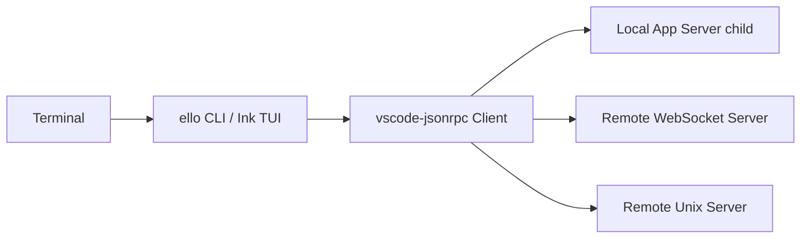

# @ello/tui

<p align="center"><a href="../../README.md">项目首页</a> · <strong>简体中文</strong> · <a href="README-en.md">English</a></p>

`@ello/tui` 是 Ello 的 Client package，包含 `ello` CLI、Ink TUI、无界面渲染器、typed JSON-RPC Client，以及 stdio、WebSocket、Unix socket transport。

它不创建模型、不执行 Command、不读取 provider 凭据，也不直接写 Thread 或 Server 文件。所有业务状态来自 `@ello/agent` 返回的 snapshot、notification 和 Server Request。

## 为什么 Client 独立成 package

| 目标             | 实现方式                                                                |
| ---------------- | ----------------------------------------------------------------------- |
| UI 不成为事实源  | Thread、Turn、Command、Goal 和任务状态全部由 Server 持久化              |
| 本地和远程一致   | 本地子进程、WebSocket 与 Unix endpoint 使用同一 JSON-RPC schema         |
| 重连可恢复       | Client 用完整 snapshot 重建界面，再消费连续事件和未完成 Server Request  |
| 自动化复用       | TUI 与 `--no-tui --json` 共享同一 typed Client，不另写 headless Agent   |
| 协议错误尽早失败 | request、result、notification 和 Server Request 都在边界通过 Zod 再校验 |

## 连接拓扑

默认启动时，CLI 创建独立的 `@ello/agent/server-entry` 子进程并通过 stdio 连接：



使用 `--remote` 时不会启动本地 Server：

```bash
ello --remote ws://127.0.0.1:4321
ello --remote unix:///tmp/ello.sock
```

远程 bearer token 通过 `--remote-auth-token-env <name>` 从命名环境变量读取，不写入命令参数或配置输出。

## 三种使用界面

### 交互式 TUI

```bash
pnpm --filter @ello/tui build
pnpm --filter @ello/tui run ello
```

TUI 把一个持续任务拆成稳定区域：

| 区域        | 内容                                                               |
| ----------- | ------------------------------------------------------------------ |
| History     | 已持久化的用户消息、模型回复、Command 结果和系统记录               |
| Live        | 当前模型流、运行中的 Command、排队 steering 和 Subagent 摘要       |
| Bottom Dock | Composer、审批/输入面板、Profile、模式、cache、token 与 Agent 列表 |

运行中可以继续提交 steering message。审批和用户输入由 Server Request 驱动；`Ctrl+C` 中断主 Agent 及其活动 child，空闲时退出。Thread 切换或重连时，Client 从 snapshot 重建 History，不重放旧 runtime event。

### 无界面运行

```bash
pnpm --filter @ello/tui run ello --no-tui run \
  "检查测试失败，修复根因并验证"
```

机器消费使用 JSON Lines：

```bash
pnpm --filter @ello/tui run ello --no-tui --json run \
  "总结当前仓库结构"
```

Benchmark 也使用这个普通 Client 入口连接 job 专属 App Server，因此评测不会绕过产品协议。

### 管理 CLI

```text
ello models
ello sessions
ello config <operation>
ello skills <operation>
ello goal <operation>
ello memory <operation>
ello tasks <operation>
ello repo
ello workspace
```

这些命令仍通过 typed Client method 操作 Server；CLI 只负责参数解析与输出。

## 协议与恢复

连接先完成 `initialize -> initialized` 握手，协商 protocol version、transport 和 Client capabilities。只有 ready 后才能调用 Thread 或管理方法。

`vscode-jsonrpc` 管理普通 request ID、pending response、乱序关联、Cancellation 和连接关闭。TUI 自己只保存用户尚未处理的审批/输入交互，不维护第二套 RPC pending map。

Server 在 request handler 内产生 notification 或 Server Request 时，会先返回当前 request response，再释放有界 outbox。恢复顺序因此稳定为：

```text
完整 snapshot -> pending Server Requests -> live notifications
```

这避免新事件先到、随后又被旧 snapshot 覆盖。

## Client 状态边界

- durable Thread log 是历史事实源，TUI store 只是可重建投影；
- runtime event 只驱动 Live，不重新制造已经持久化的 History；
- Client 检查公开 sequence 连续性，发现缺口时触发 recovery；
- connection queue 和单消息大小有明确上限，慢 Client 不会让 Server 内存无限增长；
- local Server 的 stdout 只承载 JSON-RPC，日志与诊断写 stderr。

## 开发验证

```bash
pnpm --filter @ello/tui test
pnpm --filter @ello/tui typecheck
pnpm --filter @ello/tui lint
pnpm --filter @ello/tui build
pnpm --filter @ello/tui verify-dist
```

进一步阅读：

- [TUI 使用指南](../../docs/tui/README.md)
- [输入、快捷键与命令](../../docs/tui/input-and-commands.md)
- [会话、模式与上下文](../../docs/tui/sessions-modes-and-context.md)
- [Subagent 导航](../../docs/tui/subagent-navigation-and-runtime.md)
- [Client-Server 架构](../../docs/agent/client-server-architecture.md)
- [JSON-RPC 协议](../../docs/protocol/README.md)
